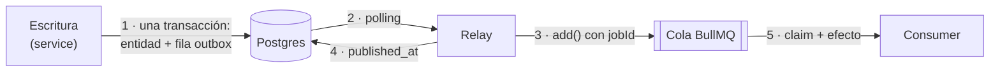

---
paths:
  - "lib/outbox/**"
  - "lib/*/repository.ts"
---

# Async / eventos (dimensión 5)

Criterios para auditar y construir procesamiento asíncrono con transactional outbox, un relay por
polling y colas BullMQ sobre Redis. Las secciones de criterios no dependen del proyecto. Lo propio de
este repo está al final, en **En este repo**.

**Cómo se usa:** cada criterio es **Base** (se audita siempre) o **Condicional** (se audita solo si
se cumple su "Aplica cuando"). En el informe, un condicional que no aplica se lista con el motivo
concreto del proyecto.

**El modelo de garantías:** el outbox asegura que el evento sale *si y solo si* la transacción
commitea; el relay y BullMQ entregan *at-least-once*. Ningún eslabón da exactly-once: el resultado
"una sola vez" se construye con dedup en el productor (O/R) y en el consumer (I).



---

## Productor — escritura y outbox (Base)

- **O1. La entidad y su evento se escriben en la misma transacción.** Nunca un `queue.add()` ni una
  llamada externa después del commit: si el proceso muere entre los dos, el efecto se pierde o sale
  sin entidad. Verificación: cada `insertOutboxEvent` recibe la transacción del repo que escribe la
  entidad; ningún service importa un cliente de cola. Ref: [Transactional outbox][ms-outbox].

  ```ts
  // ❌ si muere entre las dos líneas, la reserva existe y el mail nunca sale
  await bookingsRepo.insertBooking(booking);
  await emailsQueue.add("emails", { bookingId });

  // ✅ las dos filas commitean juntas o ninguna
  await db.transaction(async (tx) => {
    await tx.insert(bookings).values(booking);
    await tx.insert(outbox).values({ event_type: "booking.created", aggregate_id: booking.id });
  });
  ```

- **O2. Toda escritura que dispara un efecto emite su evento.** El riesgo principal del patrón es
  olvidarse de escribir la fila. Verificación: para cada mutación del alcance, listar qué efecto
  asíncrono espera el negocio (mail, notificación) y la fila de outbox que lo origina. Ref:
  [Transactional outbox — Resulting context][ms-outbox].

- **O3. La fila es thin y su tipo sale de un vocabulario cerrado.** Solo ids y el `event_type`; el
  payload rico se arma al publicar. Así una fila vieja no congela un contrato viejo. Verificación:
  la columna de payload no guarda documentos ni filas enteras; `event_type` es una unión de literales.
  Ref: [BullMQ — Going to production, Data security][bq-prod].

  ```ts
  type OutboxEventType = "booking.created" | "booking.accepted" | "booking.rejected";
  { type: "booking.accepted", payload: { listingId, guestId } } // ✅ ids
  { type: "booking.accepted", payload: { booking, guest } }     // ❌ filas enteras con PII
  ```

---

## Relay — de la fila a la cola

### Base

- **R1. Primero encola, después marca.** Si `add()` tira, la fila queda pendiente y el próximo tick
  la reintenta. El orden inverso pierde eventos; este los duplica, y los duplicados los absorben
  `jobId` (R2) y el consumer idempotente (I1, I2). Verificación: en el loop del relay, `markAsPublished` viene después
  de todos los `add()` de la fila. Ref: [Transactional outbox — Resulting context][ms-outbox].

  ```ts
  for (const job of jobs) await queues[job.queue].add(job.queue, job.data, job.opts);
  await outboxRepo.markAsPublished(event.id); // ✅ recién acá
  ```

- **R2. El `jobId` identifica el hecho, no la invocación.** Se deriva del evento de dominio e incluye
  todo lo que distingue dos efectos legítimos (la etapa del ciclo de vida). BullMQ ignora un `add()`
  con un id que ya existe, mientras el job siga retenido (ver Q3). Verificación: cada `add()` del
  relay pasa `opts.jobId` armado con ids, nunca con `Date.now()` ni un uuid nuevo. Ref: [BullMQ — Job
  Ids][bq-jobid].

  ```ts
  { jobId: `booking-${bookingId}-accepted` } // ✅ republicar la misma fila no duplica
  { jobId: `booking-${bookingId}` }          // ❌ colapsa pending, accepted y cancelled en uno
  { jobId: randomUUID() }                    // ❌ cada republicación es un job nuevo
  ```

- **R3. Una fila que nunca va a poder publicarse no traba a las demás.** Tipo desconocido o agregado
  borrado: se marca igual y se loguea, en vez de reintentarla en cada tick. Verificación: el relay
  distingue "no se pudo ahora" (no marca) de "no se va a poder nunca" (marca y loguea). Ref:
  [Transactional outbox][ms-outbox].

- **R4. El polling tiene cota.** Intervalo fijo, lote con `LIMIT`, consulta servida por un índice
  parcial sobre las pendientes, y retención de las publicadas. Verificación: la consulta del relay
  tiene `LIMIT` y su predicado coincide con el del índice (P3 y P5 de `04-datos.md`). Ref: [Polling
  publisher][ms-polling].

### Condicionales

- **R5. Varias instancias del relay no publican la misma fila a la vez.** Aplica cuando el relay
  puede correr en más de un proceso (réplicas, deploy con solapamiento). Se toma el lote con
  `FOR UPDATE SKIP LOCKED` dentro de la transacción que lo marca. Verificación: la consulta del lote
  lleva `SKIP LOCKED`, o hay una decisión documentada de instancia única. Ref: [PG — SELECT, The
  Locking Clause][pg-skip].

  ```sql
  BEGIN;
  SELECT id FROM outbox WHERE published_at IS NULL
    ORDER BY created_at LIMIT 100 FOR UPDATE SKIP LOCKED; -- la otra instancia saltea estas filas
  -- add() de cada job
  UPDATE outbox SET published_at = now() WHERE id = ANY($1);
  COMMIT;
  ```

- **R6. El orden importa solo donde el consumer lo necesita, y ahí se garantiza.** Aplica cuando un
  efecto depende de que otro del mismo agregado haya ocurrido antes. Colas con varios workers
  concurrentes no preservan orden; un consumer que lo necesita verifica el estado actual del
  agregado en vez de confiar en el orden de llegada. Verificación: para cada par de eventos del mismo
  agregado, ¿qué pasa si llegan invertidos? Ref: [Polling publisher — Drawbacks][ms-polling].

---

## Colas — configuración de BullMQ (Base)

- **Q1. Cada cola define `attempts` y backoff exponencial.** Los efectos externos fallan de forma
  transitoria; sin `attempts` un job falla a la primera. Verificación: `defaultJobOptions` de cada
  `Queue` (o las `opts` del `add()`) tiene `attempts > 1` y `backoff`. Ref: [BullMQ — Retrying
  failing jobs][bq-retry].

  ```ts
  new Queue("emails", {
    connection,
    defaultJobOptions: { attempts: 5, backoff: { type: "exponential", delay: 1000 } },
  });
  ```

- **Q2. Un error que reintentar no arregla corta con `UnrecoverableError`.** Payload inválido,
  destinatario rechazado (4xx): reintentarlo solo gasta intentos. Verificación: los handlers
  distinguen errores permanentes de transitorios. Ref: [BullMQ — Stop retrying jobs][bq-stop].

  ```ts
  import { UnrecoverableError } from "bullmq";
  if (res.statusCode === 422) throw new UnrecoverableError(`invalid recipient ${to}`);
  throw new Error(res.message); // ✅ transitorio: BullMQ reintenta con backoff
  ```

- **Q3. La retención de jobs está definida y es coherente con el dedup.** `removeOnComplete` y
  `removeOnFail` explícitos: sin ellos Redis crece sin techo. La ventana de dedup de R2 dura lo que
  dura la retención, así que tiene que cubrir el peor caso de republicación del relay. Verificación:
  las dos opciones están en `defaultJobOptions`; la retención por `age` o `count` supera la ventana
  en la que el relay puede republicar. Ref: [BullMQ — Auto-removal of jobs][bq-remove].

  ```ts
  defaultJobOptions: {
    removeOnComplete: { age: 24 * 3600 }, // ✅ un día de dedup, mucho más que un tick del relay
    removeOnFail: { age: 7 * 24 * 3600 }, // los fallidos quedan para inspeccionar
  }
  ```

- **Q4. El payload del job es mínimo y JSON-safe.** Se serializa en Redis: sin secretos, sin PII de
  más, fechas como ISO string, sin clases. Verificación: los tipos de payload solo tienen primitivos
  y no incluyen hashes, tokens ni el usuario completo. Ref: [BullMQ — Going to production, Data
  security][bq-prod].

---

## Consumer — idempotencia (Base)

- **I1. Una escritura a la propia base es idempotente por su índice único.** La clave estable
  viaja en el payload (el id de la fila de outbox) y es la misma en todos los reintentos; el
  índice único sobre ella hace que el insert sea a la vez el chequeo y la marca. Verificación: el
  handler trata el duplicado (`11000` en Mongo, `ON CONFLICT` en PG) como "ya hecho" y sale sin
  error. Ref: [Idempotent consumer][ms-idem], D3 y M2 de `04-datos.md`.

  ```ts
  try { await notifications.insertOne({ event_id: eventId, ...doc }); }
  catch (e) { if (e.code === 11000) return; throw e; }
  ```

- **I2. Un efecto externo usa la clave de idempotencia del proveedor.** La misma clave estable va
  en cada envío, y el proveedor descarta el repetido. Nunca marcar "hecho" antes del envío: si el
  envío falla, el reintento encuentra la marca y el efecto se pierde. Verificación: el envío pasa
  una clave derivada del evento, no generada en cada intento. Ref: [Resend — Idempotency
  keys][rs-idem].

  ```ts
  await resend.emails.send(email, { idempotencyKey: `notify-booking/${eventId}` }); // ✅
  if (await markAsSent(eventId)) await resend.emails.send(email); // ❌ si falla, no se reintenta
  ```

- **I3. Un job hace un solo efecto y falla con `Error`.** Varios efectos en un job vuelven parcial
  el reintento; un evento que necesita N efectos se abre en N jobs. BullMQ solo maneja bien
  excepciones que son `Error`. Verificación: cada handler termina en un efecto; no hay `throw` de
  strings ni objetos planos. Ref: [BullMQ — Idempotent jobs][bq-idem], [BullMQ — Retrying failing
  jobs][bq-retry].

  ```ts
  // ✅ el relay abre booking.accepted en dos jobs: uno a "emails", otro a "notifications"
  // ❌ un solo job que manda el mail y después escribe la notificación
  ```

---

## Runtime del worker (Base)

- **W1. Apagado ordenado.** Ante `SIGINT` y `SIGTERM`, el relay deja de hacer polling y cada worker
  cierra con `close()`, que deja de tomar jobs y espera los activos. Verificación: `index` del worker
  registra las dos señales y llama `close()` en todos los workers antes de salir. Ref: [BullMQ —
  Graceful shutdown][bq-shutdown].

  ```ts
  const shutdown = async () => {
    stopRelay();
    await Promise.all(workers.map((w) => w.close()));
    process.exit(0);
  };
  process.on("SIGINT", shutdown);
  process.on("SIGTERM", shutdown);
  ```

- **W2. Ningún handler bloquea el event loop.** Si el loop se traba, el worker no renueva el lock,
  el job se marca *stalled* y otro worker lo corre en paralelo. Trabajo CPU-intensivo va a un
  sandboxed processor o se parte. Verificación: los handlers solo hacen I/O async; `lockDuration` y
  `maxStalledCount` quedan en default salvo motivo. Ref: [BullMQ — Stalled jobs][bq-stalled].

- **W3. Todo error tiene un listener.** `error` en cada `Worker` y `Queue`, `failed` para los jobs, y
  `uncaughtException`/`unhandledRejection` a nivel proceso. Sin listener de `error`, Node puede
  terminar el proceso. Verificación: grep de `.on("error"` por cada instancia y de los dos handlers
  de proceso. Ref: [BullMQ — Going to production, Log errors][bq-prod].

  ```ts
  worker.on("error", (err) => log.error(err));
  worker.on("failed", (job, err) => log.error({ jobId: job?.id, err }));
  ```

- **W4. La conexión a Redis se configura distinto para workers y queues.** Workers:
  `maxRetriesPerRequest: null`, esperan la reconexión. Queues (productores): `enableOfflineQueue:
  false`, fallan rápido para que el relay no marque una fila que no encoló. Verificación: las opciones
  de conexión de cada `Worker` y `Queue`. Ref: [BullMQ — Going to production, Reconnections][bq-prod].

  ```ts
  new Worker("emails", processor, { connection: { url, maxRetriesPerRequest: null } });
  new Queue("emails", { connection: { url, enableOfflineQueue: false } });
  ```

---

## Redis como almacén de colas (Base)

- **S1. `maxmemory-policy noeviction`.** Con cualquier otra política, Redis puede borrar claves de
  BullMQ bajo presión de memoria y la cola queda inconsistente. Verificación: `CONFIG GET
  maxmemory-policy` devuelve `noeviction`. Ref: [BullMQ — Going to production, Max memory
  policy][bq-prod].

- **S2. Persistencia AOF con `appendfsync everysec`.** Sin persistencia, un reinicio de Redis pierde
  los jobs ya encolados, que el relay marcó como publicados y no va a reenviar. Verificación: `CONFIG
  GET appendonly` → `yes`, `CONFIG GET appendfsync` → `everysec`. Ref: [BullMQ — Going to production,
  Persistence][bq-prod], [Redis — Persistence][rd-persist].

  ```conf
  maxmemory-policy noeviction
  appendonly yes
  appendfsync everysec
  ```

---

## Fallo final y latencia (Base)

- **F1. Un job que agota sus intentos queda retenido y logueado.** El failed set es la
  dead-letter: se retiene (Q3) y el log de `failed` lleva el `jobId` y el evento de origen, para
  poder rastrearlo y reintentarlo. Verificación: `removeOnFail` no es `true`; el listener de
  `failed` loguea los dos ids. Ref: [BullMQ — Retrying failing jobs][bq-retry].

- **F2. La latencia de la fila al efecto se puede medir.** El lag es parte del contrato (los efectos
  asíncronos llegan segundos después). Verificación: la fila tiene `created_at` y `published_at`, y
  el job conserva `timestamp` y `finishedOn`; de ahí sale el lag de cada tramo. Ref: [BullMQ — Going
  to production][bq-prod].

---

## En este repo

El cableado completo (cómo agregar un evento, una cola o un processor) está en
`greenaway-worker/docs/architecture/bullmq-queues.md`.

| Pieza | Dónde |
|---|---|
| Tabla `outbox` | `lib/outbox/tables.ts` |
| `OutboxEventType` | `lib/outbox/types.ts` |
| Escritura en la transacción | `lib/outbox/repository.ts` (`insertOutboxEvent`), llamado desde los repos |
| Relay y fan-out | `greenaway-worker/src/relay.ts`, `src/outbox/fan-out.ts` |
| Queues y workers | `greenaway-worker/src/redis/queues.ts`, `src/redis/workers.ts`, `src/index.ts` |
| Handlers | `greenaway-worker/src/processors/*`, `src/emails/*`, `src/notifications/*` |
| Config de Redis | `greenaway-worker/redis.conf`, `docker-compose.yml` |

[ms-outbox]: https://microservices.io/patterns/data/transactional-outbox.html
[ms-polling]: https://microservices.io/patterns/data/polling-publisher.html
[ms-idem]: https://microservices.io/patterns/communication-style/idempotent-consumer.html
[pg-skip]: https://www.postgresql.org/docs/current/sql-select.html#SQL-FOR-UPDATE-SHARE
[bq-prod]: https://docs.bullmq.io/guide/going-to-production
[bq-jobid]: https://docs.bullmq.io/guide/jobs/job-ids
[bq-retry]: https://docs.bullmq.io/guide/retrying-failing-jobs
[bq-stop]: https://docs.bullmq.io/patterns/stop-retrying-jobs
[bq-remove]: https://docs.bullmq.io/guide/queues/auto-removal-of-jobs
[bq-idem]: https://docs.bullmq.io/patterns/idempotent-jobs
[bq-stalled]: https://docs.bullmq.io/guide/workers/stalled-jobs
[bq-shutdown]: https://docs.bullmq.io/guide/workers/graceful-shutdown
[rd-persist]: https://redis.io/docs/latest/operate/oss_and_stack/management/persistence/
[rs-idem]: https://resend.com/docs/dashboard/emails/idempotency-keys
