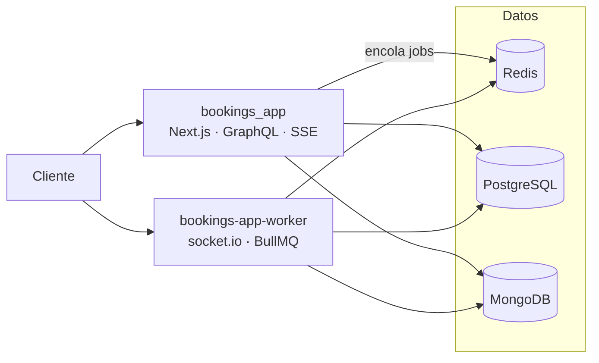

# Bookings App

Marketplace de reservas de alojamientos (estilo Airbnb simplificado), construido como **proyecto de
aprendizaje de arquitectura**. Demuestra de punta a punta: persistencia políglota (PostgreSQL +
MongoDB + Redis), procesamiento asíncrono con colas y workers, entrega en tiempo real (SSE +
WebSocket) y una API GraphQL con autorización por rol y ownership.

Dos roles: **guest** (busca, reserva, reseña) y **host** (publica y gestiona listados y reservas). Un
usuario puede ser ambos.

> Corre local. El deploy es deuda conocida y deliberada — el foco del proyecto está en la aplicación,
> no en operar infraestructura (ver `docs/tickets/`).

## Estado

**Construido:** autenticación (JWT access + refresh, con sesiones en PostgreSQL) y RBAC; listados en
MongoDB con múltiples tipos; reservas sin solapamiento; reseñas; API GraphQL (Apollo Server); notificaciones por
email asíncronas (worker + BullMQ); chat host↔guest en vivo (socket.io); notificaciones in-app (SSE);
y rate limiting en el borde de autenticación.

**Próximo:** búsqueda full-text con Elasticsearch (sincronizando Mongo → índice) y el deploy con su
observabilidad. El backlog priorizado —qué falta y qué es deuda técnica, con su justificación— vive en
`docs/tickets/`. El plan de fases completo está en `CLAUDE.md`.

## Arquitectura

Dos procesos que comparten los mismos datastores:



- **`bookings_app`** (este repo) — UI, API GraphQL, Server Actions y el borde SSE de notificaciones;
  encola el trabajo asíncrono.
- **`bookings-app-worker`** (repo aparte) — consumers de BullMQ (emails, notificaciones) y el servidor
  socket.io del chat. Es un proceso persistente (no serverless): sostiene conexiones y loops de larga
  vida, y ese requisito es lo que justifica el split app/worker.
- **PostgreSQL** — núcleo transaccional: usuarios, sesiones, reservas, reseñas.
- **MongoDB** — documentos heterogéneos: listados, chats, mensajes, notificaciones.
- **Redis** — colas (BullMQ), fan-out de sockets, rate limiting y pub/sub de las notificaciones SSE.

**Tiempo real:** SSE para notificaciones (mismo origen, dentro de Next) y socket.io para el chat (en el
worker). **Auth:** JWT access + refresh, con sesiones en PostgreSQL. El _por qué_ de estas decisiones
está en `docs/architecture/`.

## Estructura

```
app/            Rutas de Next.js (App Router) + route handlers (graphql, auth, subscribe, s3)
components/     ui/ (shadcn) · common/ (primitivos propios) · <feature>/ (bookings, chat, search…)
lib/            services/ (negocio) · repositories/ (datos) · types/ · apollo/ · dominio
db/migrations/  Migraciones de PostgreSQL, versionadas (up/down)
docs/           ADRs, insights, backlog y deuda técnica
scripts/        Migraciones, seeds y utilidades
```

## Cómo correrlo

Requiere PostgreSQL, MongoDB y Redis accesibles.

```bash
pnpm install
cp .env.example .env.local      # completar PG · Mongo · Redis · JWT · S3
pnpm db:migrate                 # migraciones de PostgreSQL
pnpm dev
```

Para emails y chat en vivo, correr `bookings-app-worker` por separado (ver su repo).

## Comandos

|                                                 |                                               |
| ----------------------------------------------- | --------------------------------------------- |
| `pnpm dev` / `build`                            | desarrollo / build de producción              |
| `pnpm lint` · `pnpm test`                       | linting · tests (Vitest)                      |
| `pnpm codegen`                                  | regenera los tipos de GraphQL desde el schema |
| `pnpm db:migrate` · `db:rollback` · `db:status` | migraciones de PostgreSQL                     |

## Documentación

El README solo orienta; el detalle vive en `/docs` y `CLAUDE.md`, organizado por **qué pregunta
responde cada uno**:

| Si querés…                                                | Andá a                                                                              |
| --------------------------------------------------------- | ----------------------------------------------------------------------------------- |
| entender **por qué** se tomó una decisión de arquitectura | `docs/architecture/` — ADRs (realtime, colas, rate limiting)                        |
| el **concepto** detrás de una API o técnica               | `docs/insights/` — índices de Postgres, `useSyncExternalStore`, capas de seguridad… |
| las **convenciones** para extender el código              | `CLAUDE.md` — patrones de services, componentes, tipos y errores                    |
| qué falta y **qué es deuda**                              | `docs/tickets/` (backlog priorizado) · `docs/tech_debt/`                            |
