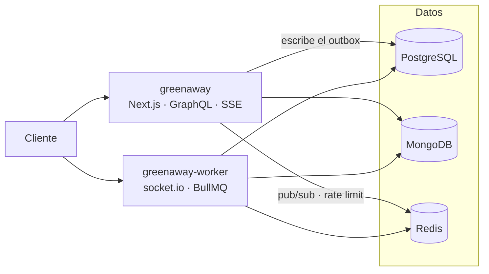

# 🏡 Greenaway

Marketplace de reservas de alojamientos (estilo Airbnb simplificado), construido como **proyecto de
aprendizaje de arquitectura**. Demuestra de punta a punta: persistencia políglota (PostgreSQL +
MongoDB + Redis), procesamiento asíncrono con colas y workers, entrega en tiempo real (SSE +
WebSocket) y una API GraphQL con autorización por rol y ownership.

Dos roles: **guest** (busca, reserva, reseña) y **host** (publica y gestiona listados y reservas). Un
usuario puede ser ambos.

> Corre local. El foco del proyecto está en la aplicación, no en operar infraestructura.

---

## 🚦 Estado

**Construido:** autenticación (JWT) y RBAC; listados en
MongoDB con múltiples tipos; reservas sin solapamiento; reseñas; API GraphQL (schema en proceso, sin endpoint HTTP);
notificaciones por email asíncronas (worker + BullMQ); chat host↔guest en vivo (socket.io);
notificaciones in-app (SSE); y rate limiting en el borde de autenticación.

**Próximo:** auditoría del sistema y entorno reproducible con Docker + seed (`docs/audit/`). La deuda
técnica conocida vive en `docs/tech_debt/`.

---

## 🏗️ Arquitectura

Dos procesos que comparten los mismos datastores:


```mermaid
flowchart LR
  U[Cliente] --> APP["greenaway<br/>Next.js · GraphQL · SSE"]
  U --> WRK["greenaway-worker<br/>socket.io · BullMQ"]
  APP -->|escribe el outbox| PG
  APP --> MG
  APP -->|pub/sub · rate limit| RD
  WRK --> PG & MG & RD
  subgraph Datos
    PG[(PostgreSQL)]
    MG[(MongoDB)]
    RD[(Redis)]
  end
```

- **`greenaway`** (este repo) — UI, API GraphQL, Server Actions y el borde SSE de notificaciones;
  registra el trabajo asíncrono como filas de outbox, en la misma transacción que la entidad.
- **`greenaway-worker`** (repo aparte) — el relay que publica el outbox en BullMQ, sus consumers
  (emails, notificaciones) y el servidor socket.io del chat. Es un proceso persistente (no serverless): sostiene conexiones y loops de larga
  vida, y ese requisito es lo que justifica el split app/worker.
- **PostgreSQL** — núcleo transaccional: usuarios, reservas, reseñas y el outbox.
- **MongoDB** — documentos heterogéneos: listados, chats, mensajes, notificaciones.
- **Redis** — colas (BullMQ), fan-out de sockets, rate limiting y pub/sub de las notificaciones SSE.

**Tiempo real:** SSE para notificaciones (mismo origen, dentro de Next) y socket.io para el chat (en el
worker). **Auth:** JWT en cookie httpOnly. El _por qué_ de estas decisiones
está en `docs/architecture/`.

---

## 📁 Estructura

```
app/            Rutas de Next.js (App Router) + route handlers (graphql, subscribe, s3)
components/     ui/ (shadcn) · common/ (primitivos propios) · <feature>/ (bookings, chat, search…)
lib/            <service>/ (auth, bookings, chat, listings, notifications, reviews, users) ·
                apollo/ (schema raíz y cliente) · infra/ (clientes de DB y servicios) · shared/
db/migrations/  Migraciones de PostgreSQL, generadas por drizzle-kit desde lib/*/tables.ts
docs/           ADRs, deuda técnica y auditoría
scripts/        Seeds y utilidades de datos
```

---

## 📦 Prerequisitos

- **Node.js 20+** y **pnpm**
- **PostgreSQL**, **MongoDB** y **Redis** accesibles (localmente o vía Docker)
- Para emails y chat en vivo: el repo **`greenaway-worker`** corriendo por separado

---

## 🚀 Cómo correrlo

```bash
pnpm install
cp .env.example .env.local      # completar PG · Mongo · Redis · JWT · S3
pnpm db:migrate                 # migraciones de PostgreSQL
pnpm dev
```

La app queda en `http://localhost:3000`. Para emails y chat en vivo, correr `greenaway-worker` por
separado (ver su repo).

---

## ⚙️ Comandos

|                                                 |                                               |
| ----------------------------------------------- | --------------------------------------------- |
| `pnpm dev` / `build`                            | desarrollo / build de producción              |
| `pnpm lint` · `pnpm test`                       | linting · tests (Vitest)                      |
| `pnpm codegen`                                  | regenera los tipos de GraphQL desde el schema |
| `pnpm db:generate` · `db:migrate`              | genera / aplica migraciones de PostgreSQL     |

---

## 📚 Documentación

El README solo orienta; el detalle vive en `/docs` y `.claude/rules/`, organizado por **qué pregunta
responde cada uno**:

| Si querés…                                                | Andá a                                                                              |
| --------------------------------------------------------- | ----------------------------------------------------------------------------------- |
| entender **por qué** se tomó una decisión de arquitectura | `docs/architecture/` — ADRs (realtime, colas, rate limiting)                        |
| las **convenciones** para extender el código              | `.claude/rules/` — una regla por dimensión; índice en `CLAUDE.md`                   |
| qué es **deuda conocida**                                  | `docs/tech_debt/`                                                                   |

---

## 📄 Licencia

Sin licencia definida todavía: hasta que se agregue un archivo `LICENSE`, se reservan todos los
derechos. Elegir una es un pendiente para exponer el proyecto públicamente.

---

## 👤 Autor

**Agustín Tisera** — proyecto de portfolio. _(Contacto y links: a completar.)_
