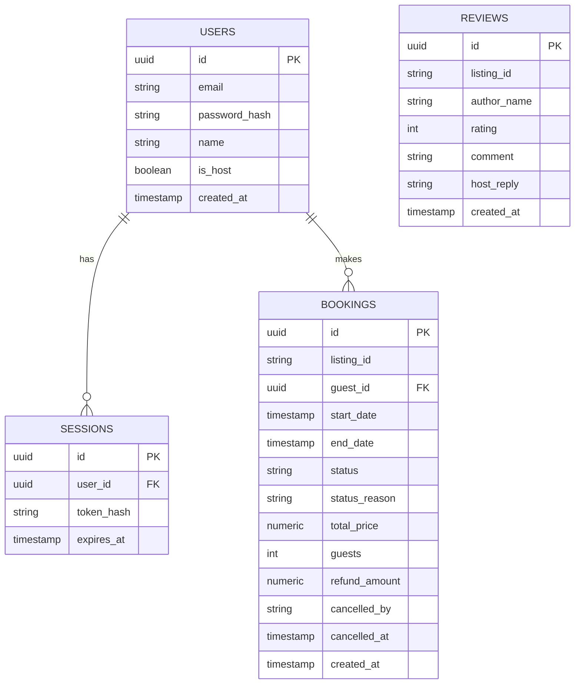
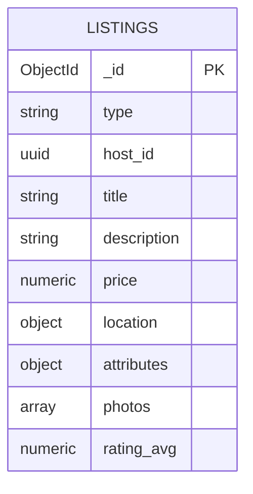
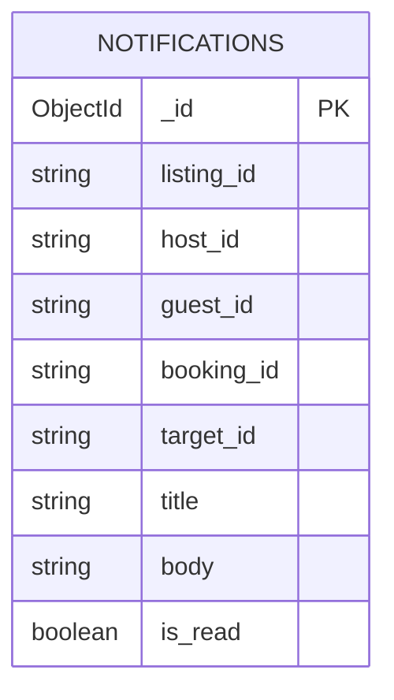
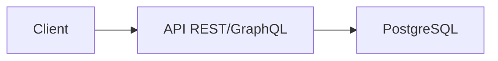
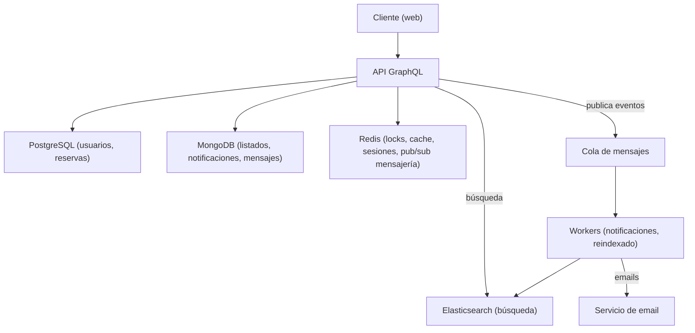
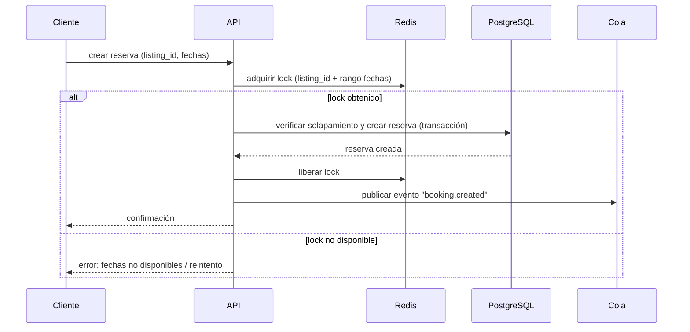

# Proyecto B — Marketplace de reservas (estilo Airbnb simplificado)

## 1. Resumen

Plataforma de reservas de alojamientos, con evolución planificada hacia múltiples tipos de listados (experiencias, equipamiento). Enfocado en **persistencia poliglota, procesamiento asíncrono y APIs GraphQL**.

Tema central de aprendizaje: **integración de múltiples bases de datos especializadas, consistencia eventual, colas de mensajes, y diseño de APIs GraphQL con autorización granular**.

---

## 2. Roles de usuario

| Rol | Descripción |
|---|---|
| Guest | Busca, filtra, reserva alojamientos, deja reseñas |
| Host | Crea y administra sus propios listados, gestiona disponibilidad y reservas recibidas |

> El rol **admin** se quitó del sistema y no se va a desarrollar (migración `006` dropea `users.is_admin`). Un usuario puede tener rol guest y host simultáneamente.

---

## 3. Requerimientos funcionales

### 3.1 Autenticación y cuentas
- RF-01: Registro y login (JWT access + refresh token)
- RF-02: Un usuario puede tener rol guest y host simultáneamente (no son excluyentes)
- ~~RF-03~~: quitado — el panel de administración se eliminó junto con el rol admin

### 3.2 Listados (alojamientos — Fase 1)
- RF-04: Host crea un listado: título, descripción, precio por noche, ubicación, capacidad, fotos
- RF-05: Host edita o elimina sus propios listados
- RF-06: Guest puede ver el detalle de un listado, incluyendo calendario de disponibilidad
- RF-07: Guest puede buscar listados por ubicación, rango de fechas y precio

### 3.3 Reservas
- RF-08: Guest reserva un listado para un rango de fechas
- RF-09: El sistema **no permite** reservas con solapamiento de fechas para el mismo listado
- RF-10: Host puede ver las reservas de sus listados
- RF-11: Guest puede cancelar una reserva (según política de cancelación del listado)

### 3.4 Reseñas
- RF-12: Guest puede dejar una reseña (rating 1-5 + comentario) después de una estadía finalizada
- RF-13: Host puede responder públicamente a una reseña

### 3.5 Catálogo extendido (Fase 2+)
- RF-14: Host puede crear listados de tipo "experiencia" (duración, idioma, punto de encuentro) o "equipamiento" (unidades disponibles, depósito)
- RF-15: Cada tipo de listado tiene atributos propios sin afectar el modelo de los demás tipos

### 3.6 Búsqueda avanzada (Fase 4+)
- RF-16: Búsqueda full-text sobre título y descripción de listados
- RF-17: Filtros combinables: tipo de listado, rango de precio, ubicación, rating mínimo
- RF-18: Resultados de búsqueda reflejan cambios de listados en un tiempo razonable (segundos), no necesariamente instantáneo

### 3.7 Notificaciones (Fase 5+)
- RF-19: Host recibe notificación (email) ante una nueva reserva
- RF-20: Guest recibe notificación de confirmación de reserva
- RF-21: Las notificaciones se procesan de forma asíncrona, sin bloquear la respuesta de la API

### 3.8 Mensajería guest ↔ host (Fase 3+)
- RF-22: Guest y host pueden intercambiar mensajes directos en el contexto de un listado o reserva
- RF-23: Los mensajes se entregan en tiempo real — la conexión/entrega en vivo se establece vía Redis (Pub/Sub)
- RF-24: El historial de conversación se persiste en MongoDB y se recupera al reabrir la conversación

---

## 4. Requerimientos no funcionales

- RNF-01: **Consistencia transaccional** — la creación de una reserva debe ser atómica: no debe ser posible que dos reservas se confirmen para el mismo rango de fechas del mismo listado, incluso bajo concurrencia (race conditions)
- RNF-02: **Consistencia eventual aceptable** — el índice de búsqueda (Elasticsearch) puede estar desactualizado por unos segundos respecto a la fuente de verdad (MongoDB/Postgres)
- RNF-03: **Aislamiento de responsabilidades por motor de DB**:
  - PostgreSQL: usuarios, reservas, pagos, relaciones con integridad referencial
  - MongoDB: listados (esquema flexible según tipo), notificaciones, historial de mensajería
  - Redis: locks de concurrencia para reservas, cache de disponibilidad, sesiones, Pub/Sub para mensajería en tiempo real
  - Elasticsearch: índice de búsqueda de listados
- RNF-04: **Procesamiento asíncrono** — notificaciones y sincronización del índice de búsqueda se procesan vía cola de mensajes (no en el ciclo de request/response)
- RNF-05: **Autorización granular** — cada mutación de la API GraphQL valida el rol del usuario y, cuando aplica, que sea el owner del recurso (ej. solo el host dueño puede editar su listado)
- RNF-06: **Rate limiting** — límite de requests por usuario/IP, especialmente en endpoints de búsqueda y creación de reservas
- RNF-07: **Observabilidad** — trazabilidad de una reserva a través de todo el flujo (API → Postgres → cola → workers → notificación)

---

## 5. Modelo de datos

### 5.1 PostgreSQL (núcleo transaccional)

> `listing_id` (en `BOOKINGS` y `REVIEWS`) referencia un documento de MongoDB — la referencia se guarda como string (ObjectId de 24 chars), sin foreign key real entre motores. `REVIEWS` no tiene FKs: guarda `author_name` desnormalizado.
>
> Constraints relevantes: `status` es un set cerrado (`pending | accepted | rejected | cancelled`, CHECK en migración 004; `completed` se deriva, no se persiste), el no-solapamiento se garantiza con una `EXCLUDE` constraint (gist) sobre `listing_id` + rango de fechas (migración 003), y los montos son `NUMERIC(10,2)` (migración 005).

### 5.2 MongoDB (catálogo de listados — `listingsdb.listings`)

> `attributes` es un objeto cuya forma depende de `type`: `accommodation` (beds, check_in_time...), `experience` (duration_minutes, language...), `equipment` (units_available, deposit...). `location` incluye city, country, address y coordenadas GeoJSON opcionales.

### 5.3 MongoDB (notificaciones — `notificationsdb.notifications`)

> `target_id` es el usuario que debe recibir la notificación. `created_at` no se persiste en el documento: se deriva del timestamp embebido en el `ObjectId` al proyectar en el repositorio.

---

## 6. Arquitectura por fase

### Fase 1 — Solo PostgreSQL

### Fase 2-4 — Arquitectura completa (poliglota)

### Flujo: creación de reserva (con lock de concurrencia)

---

## 7. Plan de fases

1. **Fase 1**: PostgreSQL únicamente. Auth + RBAC (guest/host), CRUD de listados (solo alojamientos), reservas sin solapamiento (constraint/transacción en Postgres), reseñas. API REST o GraphQL simple.
2. **Fase 2**: Migrar listados a MongoDB. Soportar múltiples `type` de listado con `attributes` flexibles. API GraphQL para listados (consultas anidadas listado → reseñas → host).
3. **Fase 3**: Redis para locks de concurrencia en reservas + cache de disponibilidad + sesiones. Mensajería guest ↔ host en tiempo real: Redis (Pub/Sub) para establecer la conexión y entregar mensajes en vivo; el historial de la conversación se persiste en MongoDB.
4. **Fase 4**: Elasticsearch para búsqueda full-text y filtros combinados. Cola de mensajes (RabbitMQ o Redis Streams) para sincronizar Mongo → Elasticsearch.
5. **Fase 5**: Workers para notificaciones por email ante eventos de reserva. Trazabilidad del flujo completo.
6. **Fase 6 — Hardening**: reverse proxy (Nginx) con rate limiting, métricas (Prometheus/Grafana), tracing (OpenTelemetry), pruebas de carga (k6) sobre el endpoint de creación de reservas.

---

## 8. Stack sugerido

- **Backend**: Node.js (NestJS o Express) o Python (FastAPI)
- **API**: GraphQL (Apollo Server o similar) desde Fase 2; REST simple en Fase 1
- **DBs**: PostgreSQL, MongoDB, Redis, Elasticsearch
- **Cola de mensajes**: RabbitMQ (o Redis Streams para empezar más simple)
- **Auth**: JWT (access + refresh)
- **Infra local**: Docker Compose (todos los servicios anteriores + API)
- **Hardening**: Nginx, Prometheus + Grafana, OpenTelemetry, k6

---

## 9. Preguntas abiertas / decisiones a tomar durante el desarrollo

- ¿El lock de Redis es por listado completo o por rango de fechas específico? (afecta granularidad de concurrencia permitida)
- ¿Qué pasa si falla la publicación del evento a la cola después de confirmar la reserva en Postgres? (¿outbox pattern?)
- ¿Cómo se versiona el esquema de `attributes` en MongoDB si se agregan nuevos tipos de listado más adelante?
- ¿La búsqueda debe incluir listados con reservas activas, o solo disponibilidad real (requeriría cruzar con Postgres)?
