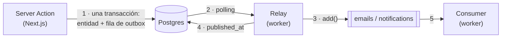

# Arquitectura de colas (BullMQ + Redis)

> **Este archivo es compartido entre dos repos** (la app de bookings y el worker).
> Mantené una copia idéntica en ambos. Si cambiás el contrato de un payload, actualizás
> este doc **y** las dos copias en el mismo cambio.

Guía para agregar un nuevo job processor y que quede alineado de los dos lados.
Léela completa antes de escribir código de colas.

---

## Panorama

**La app ya no encola.** Desde el outbox pattern, el único productor es el relay del worker; Next.js
solo escribe una fila en Postgres. El porqué está en `docs/insights/OUTBOX_AND_SAGA.md` (repo de la
app); acá va cómo queda el cableado.



- La **app** nunca toca Redis en el path de escritura: escribe la entidad y su fila de `outbox` en la
  misma transacción, y termina. Si Redis está caído, la reserva igual queda con su efecto pendiente.
- El **relay** (`src/relay.ts`) es el productor: lee las filas sin publicar, las traduce a jobs
  (`src/outbox/fan-out.ts`) y las encola. Publica y marca; **no** espera al consumer.
- El **consumer** (`src/processors/*`) ejecuta el trabajo pesado. Se entera por la cola, nunca por el
  relay.

**Consecuencia para los contratos:** productor y consumer viven ahora en el **mismo repo**, así que los
`*Payload` dejaron de estar duplicados. La fuente única es `src/events.ts` del worker.

---

## Reglas del payload (no negociables)

Un payload cruza un boundary de proceso y se **serializa a JSON** en Redis. Por lo tanto:

1. **Mínimo.** Solo los campos que el consumer realmente usa. Nada de filas de DB completas ni
   documentos enteros "por las dudas".
2. **Sin secretos ni PII de más.** Jamás `password_hash`, tokens, ni el `User` completo. Si necesitás el
   host, mandá `{ name }`, no el row.
3. **JSON-safe.** Nada de `Date`, `ObjectId`, `Buffer`, clases. **Las fechas van como ISO string**
   (`new Date(x).toISOString()`), porque es lo único que sobrevive el transporte de forma honesta.
4. **Autodescriptivo.** El payload trae `processorKey` (ver abajo) para que el worker sepa qué hacer sin
   inspeccionar el resto.

> **La fila de outbox tiene su propia regla, y es la opuesta:** es *thin* — sólo ids. El payload rico se
> arma en el relay, al publicar. Meter el payload de la cola dentro de la fila congelaría el contrato
> dentro de Postgres, y las filas viejas quedarían con el contrato viejo.

---

## Convenciones

### Conexión a Redis

- **Worker:** una sola var `REDIS_URL`, leída directo en cada cliente (`src/redis/workers.ts`,
  `src/redis/queues.ts`, `src/redis/client.ts`, `src/redis/socket.ts`).
- **App:** ya no conecta a Redis para colas. `getRedisConnectionParams()` (`lib/redis-config.ts`) sigue
  vivo para el subscriber SSE (`lib/subscriber.ts`) y la cota de abuso (`lib/redis.ts`).

### Nombres de cola

- Una cola = una **familia de trabajo**, no un job puntual. Ej: `"emails"` agrupa todos los mails
  (booking pending, booking accepted…); `"notifications"` agrupa las notificaciones in-app.
- El string es literal y **tiene que ser idéntico** en `new Queue("emails")` (`src/redis/queues.ts`) y
  `new Worker("emails")` (`src/redis/workers.ts`).

### `processorKey` — ruteo dentro de una cola

Una cola transporta **varios tipos de job**. El discriminante es `processorKey` dentro del payload; el
worker rutea con un **job map** (`Record<processorKey, handler>`) sobre ese campo. El nombre de job de
BullMQ (`queue.add(name, data)`) **no** se usa para rutear.

`processorKey` se tipa como **literal** (`"notify-booking"`), no como `string`, para que el job map se
indexe por esos literales; si llega un `processorKey` sin handler, el dispatcher tira (y BullMQ
reintenta).

**`processorKey` vs. una variación del mismo trabajo.** El `processorKey` distingue *trabajos distintos*
(mandar un mail vs. sincronizar a Elasticsearch). Variaciones del **mismo** trabajo — misma plantilla,
distinta copy según el estado — **no** son un `processorKey` nuevo: van con un campo discriminante en el
payload. Ej.: los mails `pending` / `approved` / `rejected` / `cancelled` son todos el mismo
`notify-booking` con distinto `type`, no cuatro processors.

---

## Cómo se ve hoy (referencia canónica: email de reserva)

### App — la escritura y su fila

El service decide el `event_type` (es vocabulario de dominio); el repo lo escribe en la misma
transacción que la entidad, con un CTE:

```ts
// lib/services/bookings.ts
await bookingsRepo.updateBooking(
  bookingId,
  { status: "accepted" },
  { type: "booking.accepted", payload: { listingId, guestId } },
);
```

Los `OutboxEventType` válidos viven en `lib/types/outbox.ts`. **Agregar uno obliga a enseñárselo al
`toJobs` del worker**: un tipo que no conoce se descarta con un log.

### Worker — el fan-out (`src/outbox/fan-out.ts`)

Un evento de dominio se abre en N jobs. Como la fila es thin, acá se rehidrata todo lo que los payloads
renderizan:

```ts
const BOOKING_EVENTS = {
  "booking.created":  { email: "pending",  notify: "notify_user",           recipient: "host" },
  "booking.accepted": { email: "approved", notify: "notify_booking_update", recipient: "guest" },
  // …
};

// `null` = la fila no se va a poder publicar nunca (tipo desconocido, o el agregado ya no está).
// El relay la marca igual: sin eso, una fila podrida se reintenta en cada tick para siempre.
export async function toJobs(event: Outbox): Promise<QueuedJob[] | null>;
```

### Worker — el relay (`src/relay.ts`)

```ts
const jobs = await toJobs(event);
for (const job of jobs ?? []) await queues[job.queue].add(job.queue, job.data, job.opts);
// Recién ahora. Si un add() tira, la fila queda pendiente y el próximo tick la reintenta.
await outboxRepo.markAsPublished(event.id);
```

`published_at` responde *"¿se entregó a la cola?"*, no *"¿se mandó el mail?"*. Cuando el `add` retorna,
BullMQ ya persistió el job y se hace cargo de reintentarlo.

### Worker — el consumer

```ts
// Un Worker por cola. `createProcessor` (src/processors/dispatch.ts) busca el handler por
// processorKey; si no existe —o si el handler tira— re-lanza para que BullMQ reintente.
// Los workers se crean con `autorun: false` y se arrancan en el bootstrap (src/index.ts).
export const emailsWorker = new Worker("emails", emailsProcessor, { connection, autorun: false });

const emailsProcessor = createProcessor("emailsProcessor", {
  "greet-user": greetUser,
  "notify-booking": notifyBooking,
});
```

---

## Agregar un nuevo job processor

Tomá una decisión primero: **¿entra en una cola existente o necesita una nueva?**
Misma familia de trabajo (otro tipo de mail) → cola existente, nuevo `processorKey`.
Familia distinta con distinto perfil de retry/concurrencia (ej. sync a Elasticsearch) → cola nueva.

### En la app

1. **Agregá el `OutboxEventType`** en `lib/types/outbox.ts`.
2. **Escribí la fila en la misma transacción** que la entidad, con el CTE del repo correspondiente
   (`createBookingRecord` / `updateBooking` / `createUser` son los modelos). Payload thin: sólo ids.
3. **`tsc` + `lint`** verde.

### En el worker

1. **Definí el `type XxxPayload`** en `src/events.ts`, con `processorKey: "xxx"` literal, mínimo y
   JSON-safe (fechas ISO).
2. **Enseñale el evento a `toJobs`** (`src/outbox/fan-out.ts`): rehidratá lo que el payload necesita y
   devolvé el `QueuedJob` con su `jobId` determinístico. Si el agregado no está, `null`.
3. **Nuevo handler** `async function processXxx(job)`: castea `job.data as XxxPayload` y hace el trabajo.
   Si algo falla, dejá que el error propague — `createProcessor` lo loguea y lo re-lanza.
4. **Registrá el caso** en el job map de la cola (`{ "xxx": processXxx }`).
5. Si es cola nueva: agregala a `src/redis/queues.ts`, creá su `Worker` en `src/redis/workers.ts`,
   sumala al map `queues` del relay y arrancala en `src/index.ts`.
6. **`tsc`** verde y el efecto ocurre igual.

---

## Idempotencia — `jobId` determinístico

BullMQ es *at-least-once*, y el relay le suma su propia ventana: puede publicar y morir antes de marcar
`published_at`, con lo cual el próximo tick republica. El productor tiene que asumir que va a encolar el
mismo hecho dos veces.

La herramienta es un `jobId` derivado del evento de dominio. **La clave identifica el hecho, no la
invocación** (`src/outbox/fan-out.ts`):

```ts
{ jobId: `booking-${booking.id}-${spec.email}` }        // reserva + etapa del ciclo de vida
{ jobId: `notification-${booking.id}-${spec.email}` }
{ jobId: `greet-${user.id}` }                            // sin etapa que desambiguar
```

La etapa **tiene que ir en la clave**. Una misma reserva emite `pending`, `approved` y `cancelled`, y
son mails distintos que sí deben salir todos; una clave sin ella los colapsaría en uno.

### Las dos cotas que hay que tener presentes

**1. La ventana de dedup es la retención, no "para siempre".** BullMQ solo puede descartar un `jobId`
repetido mientras ese job **siga en Redis**. Con `removeOnComplete: 1000`, pasados 1000 jobs
completados el mismo id vuelve a entrar. Es una ventana de volumen, no de tiempo: cuanto más tráfico,
más corta. Si hiciera falta una garantía real de "una sola vez", el dedup tendría que salir de la cola
y pasar a una tabla de efectos ya aplicados.

**2. Protege el encolado, no el envío.** `attempts` reintenta **ese mismo job**; no encola uno nuevo,
así que el `jobId` no interviene. La dedup evita el **doble encolado**; el doble envío dentro de un
mismo job (Resend mandó, la respuesta se perdió, el handler tiró) es otro problema y necesitaría
idempotencia del efecto.

> Esa distinción es la más fácil de pasar por alto: `jobId` resuelve el productor, no el consumer.

---

## Checklist rápido

**Fila de outbox:** thin (sólo ids) · en la misma transacción que la entidad · `event_type` en `lib/types/outbox.ts`.
**Payload:** mínimo · JSON-safe · fechas ISO · sin secretos · `processorKey` literal.
**Relay:** el `case` en `toJobs` · `jobId` determinístico · `null` si el agregado no está.
**Consumer:** handler + caso en el job map de la cola · sin secretos que loguear.
