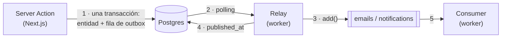

# Arquitectura de colas (BullMQ + Redis)

> **Este archivo es compartido entre dos repos** (la app de bookings y el worker).
> Mantené una copia idéntica en ambos. Si cambiás el contrato de un payload, actualizás
> este doc **y** las dos copias en el mismo cambio.

Guía para agregar un nuevo job processor y que quede alineado de los dos lados.
Léela completa antes de escribir código de colas.

---

## Panorama

**La app ya no encola.** Desde el outbox pattern, el único productor es el relay del worker; Next.js
solo escribe una fila en Postgres. El porqué está en `docs/insights/OUTBOX_AND_SAGA.md` (repo de la
app); acá va cómo queda el cableado.



- La **app** nunca toca Redis en el path de escritura: escribe la entidad y su fila de `outbox` en la
  misma transacción, y termina. Si Redis está caído, la reserva igual queda con su efecto pendiente.
- El **relay** (`src/relay.ts`) es el productor: lee las filas sin publicar, las traduce a jobs
  (`src/outbox/fan-out.ts`) y las encola. Publica y marca; **no** espera al consumer.
- El **consumer** (`src/processors/*`) ejecuta el trabajo pesado. Se entera por la cola, nunca por el
  relay.

**Consecuencia para los contratos:** productor y consumer viven ahora en el **mismo repo**, así que los
`*Payload` dejaron de estar duplicados. La fuente única es `src/events.ts` del worker.

---

## Reglas del payload (no negociables)

Un payload cruza un boundary de proceso y se **serializa a JSON** en Redis. Por lo tanto:

1. **Mínimo.** Solo los campos que el consumer realmente usa. Nada de filas de DB completas ni
   documentos enteros "por las dudas".
2. **Sin secretos ni PII de más.** Jamás `password_hash`, tokens, ni el `User` completo. Si necesitás el
   host, mandá `{ name }`, no el row.
3. **JSON-safe.** Nada de `Date`, `ObjectId`, `Buffer`, clases. **Las fechas van como ISO string**
   (`new Date(x).toISOString()`), porque es lo único que sobrevive el transporte de forma honesta.
4. **Autodescriptivo.** El payload trae `processorKey` (ver abajo) para que el worker sepa qué hacer sin
   inspeccionar el resto.

> **La fila de outbox tiene su propia regla, y es la opuesta:** es *thin* — sólo ids. El payload rico se
> arma en el relay, al publicar. Meter el payload de la cola dentro de la fila congelaría el contrato
> dentro de Postgres, y las filas viejas quedarían con el contrato viejo.

---

## Convenciones

### Conexión a Redis

- **Worker:** una sola var `REDIS_URL`, leída directo en cada cliente (`src/redis/workers.ts`,
  `src/redis/queues.ts`, `src/redis/client.ts`, `src/redis/socket.ts`).
- **App:** ya no conecta a Redis para colas. `getRedisConnectionParams()` (`lib/redis-config.ts`) sigue
  vivo para el subscriber SSE (`lib/subscriber.ts`) y la cota de abuso (`lib/redis.ts`).

### Nombres de cola

- Una cola = una **familia de trabajo**, no un job puntual. Ej: `"emails"` agrupa todos los mails
  (booking pending, booking accepted…); `"notifications"` agrupa las notificaciones in-app.
- El string es literal y **tiene que ser idéntico** en `new Queue("emails")` (`src/redis/queues.ts`) y
  `new Worker("emails")` (`src/redis/workers.ts`).

### `processorKey` — ruteo dentro de una cola

Una cola transporta **varios tipos de job**. El discriminante es `processorKey` dentro del payload; el
processor de la cola rutea con un `switch` sobre ese campo. El nombre de job de BullMQ
(`queue.add(name, data)`) **no** se usa para rutear.

`processorKey` se tipa como **literal** (`"notify-booking"`), no como `string`, y eso es lo que hace
funcionar todo lo demás: los jobs de una cola se juntan en una **unión discriminada** (`EmailJob`,
`NotificationJob` en `src/events.ts`), el `switch` narrowea el payload dentro de cada `case` —el handler
recibe su tipo exacto, sin castear— y el `default` lo asigna a `never`, así que **un job sin su `case` no
compila**. Si igual llegara uno desconocido por la cola, tira (y BullMQ reintenta).

**`processorKey` vs. una variación del mismo trabajo.** El `processorKey` distingue *trabajos distintos*
(mandar un mail vs. sincronizar a Elasticsearch). Variaciones del **mismo** trabajo — misma plantilla,
distinta copy según el estado — **no** son un `processorKey` nuevo: van con un campo discriminante en el
payload. Ej.: los mails `pending` / `approved` / `rejected` / `cancelled` son todos el mismo
`notify-booking` con distinto `type`, no cuatro processors.

---

## Cómo se ve hoy (referencia canónica: email de reserva)

### App — la escritura y su fila

El service decide el `event_type` (es vocabulario de dominio); el repo lo escribe en la misma
transacción que la entidad, con un CTE:

```ts
// lib/services/bookings.ts
await bookingsRepo.updateBooking(
  bookingId,
  { status: "accepted" },
  { type: "booking.accepted", payload: { listingId, guestId } },
);
```

Los `OutboxEventType` válidos viven en `lib/types/outbox.ts`. **Agregar uno obliga a enseñárselo al
resolver de su agregado en el worker**: un tipo que no conoce se descarta con un log.

### Worker — el fan-out (`src/outbox/fan-out.ts`)

Un evento de dominio se abre en N jobs. Como la fila es thin, acá se rehidrata todo lo que los payloads
renderizan. El ruteo tiene **dos niveles**, porque un `event_type` es `<agregado>.<verbo>`: el prefijo
elige el resolver del agregado, y cada resolver se ocupa de sus propios verbos.

```ts
// `null` = la fila no se va a poder publicar nunca (tipo desconocido, o el agregado ya no está).
// El relay la marca igual: sin eso, una fila podrida se reintenta en cada tick para siempre.
export async function toJobs(event: Outbox): Promise<QueuedJob[] | null> {
  const isUserEvent = event.event_type.startsWith("user.");
  const isBookingEvent = event.event_type.startsWith("booking.");

  if (isUserEvent) return getUserJob(event);       // 2º nivel: switch por verbo
  if (isBookingEvent) return getBookingJob(event); // 2º nivel: tabla BOOKING_EVENTS
  // …
}

const BOOKING_EVENTS = {
  "booking.created":  { email: "pending",  notify: "notify_user",           recipient: "host" },
  "booking.accepted": { email: "approved", notify: "notify_booking_update", recipient: "guest" },
  // …
};
```

### Worker — el relay (`src/relay.ts`)

```ts
const jobs = await toJobs(event);
for (const job of jobs ?? []) await queues[job.queue].add(job.queue, job.data, job.opts);
// Recién ahora. Si un add() tira, la fila queda pendiente y el próximo tick la reintenta.
await outboxRepo.markAsPublished(event.id);
```

`published_at` responde *"¿se entregó a la cola?"*, no *"¿se mandó el mail?"*. Cuando el `add` retorna,
BullMQ ya persistió el job y se hace cargo de reintentarlo.

### Worker — el consumer

Un Worker por cola, creado con `autorun: false` y arrancado en el bootstrap (`src/index.ts`), que ahí
mismo centraliza el log de fallos (`worker.on("failed")`). El processor es **el índice de la cola y nada
más**: un `case` por `processorKey`, y el trabajo vive en el archivo de su evento.

```ts
// src/processors/emails.ts
export async function emailsProcessor(job: Job) {
  const payload = job.data as EmailJob;

  switch (payload.processorKey) {
    case "notify-booking":
      return notifyBooking(payload); // llega como BookingPayload, ya narrowed
    case "greet-user":
      return greetUser(payload);
    default: {
      const unhandled: never = payload; // un `case` que falte rompe acá
      void unhandled;
      throw new Error(`[emailsProcessor]: unknown processorKey ${job.data.processorKey}`);
    }
  }
}
```

> **Mientras una cola transporta un solo tipo de job** (hoy `notifications`), TS **no** reduce `payload`
> a `never` en el `default`: con una unión de un miembro el que narrowea es el discriminante
> (`payload.processorKey`). Con dos o más es al revés. Ref: `src/processors/notifications.ts`.

---

## Agregar un nuevo job processor

Tomá una decisión primero: **¿entra en una cola existente o necesita una nueva?**
Misma familia de trabajo (otro tipo de mail) → cola existente, nuevo `processorKey`.
Familia distinta con distinto perfil de retry/concurrencia (ej. sync a Elasticsearch) → cola nueva.

### En la app

1. **Agregá el `OutboxEventType`** en `lib/types/outbox.ts`.
2. **Escribí la fila en la misma transacción** que la entidad, con el CTE del repo correspondiente
   (`createBookingRecord` / `updateBooking` / `createUser` son los modelos). Payload thin: sólo ids.
3. **`tsc` + `lint`** verde.

### En el worker

1. **Definí el `type XxxPayload`** en `src/events.ts`, con `processorKey: "xxx"` literal, mínimo y
   JSON-safe (fechas ISO). Intersecalo con `Claimable` para que lleve el `eventId`, y **sumalo a la
   unión de su cola** (`EmailJob` / `NotificationJob`). Desde ahí, `tsc` te va marcando lo que falta.
2. **Enseñale el evento al resolver de su agregado** (`getUserJob` / `getBookingJob` en
   `src/outbox/fan-out.ts`); si el agregado es nuevo, sumale su resolver y su rama en `toJobs`.
   Rehidratá lo que el payload necesita y devolvé el `QueuedJob` con su `jobId` determinístico y el
   `eventId` del outbox en `data`. Si el agregado no está, `null`.
3. **Un archivo para el evento**, `src/<cola>/<evento>.ts`, con todo lo suyo: su copy/template, su
   builder puro si hace falta, y el handler `async function processXxx(payload: XxxPayload)` — recibe el
   payload **ya tipado**, no el `Job`. Adentro: **claimeá el efecto** (ver Idempotencia) y hacé el
   trabajo. Si algo falla, dejá que el error propague: BullMQ reintenta y el fallo se loguea solo.
4. **Agregá su `case`** al switch del processor de la cola (`src/processors/<cola>.ts`).
5. Si es cola nueva: agregala a `src/redis/queues.ts`, creá su `Worker` en `src/redis/workers.ts` con su
   processor, sumala al map `queues` del relay y al bootstrap de `src/index.ts`.
6. **`tsc`** verde y el efecto ocurre igual.

---

## Idempotencia — dos capas

BullMQ es *at-least-once*, y el relay le suma su propia ventana: puede publicar y morir antes de marcar
`published_at`, con lo cual el próximo tick republica. Nadie puede asumir que un hecho se encola —ni que
un job corre— una sola vez.

Se cubre en dos lugares, y **cada uno tapa una mitad distinta**.

### 1. Productor — `jobId` determinístico

Un `jobId` derivado del evento de dominio. **La clave identifica el hecho, no la invocación**
(`src/outbox/fan-out.ts`):

```ts
{ jobId: `booking-${booking.id}-${spec.email}` }        // reserva + etapa del ciclo de vida
{ jobId: `notification-${booking.id}-${spec.email}` }
{ jobId: `greet-${user.id}` }                            // sin etapa que desambiguar
```

La etapa **tiene que ir en la clave**. Una misma reserva emite `pending`, `approved` y `cancelled`, y
son mails distintos que sí deben salir todos; una clave sin ella los colapsaría en uno.

Dos cotas: la ventana de dedup es la **retención**, no "para siempre" (con `removeOnComplete: 1000`, a
los mil jobs completados el mismo id vuelve a entrar — es volumen, no tiempo); y protege el **encolado,
no el envío**, porque `attempts` reintenta *ese mismo job* sin pasar por el `jobId`.

### 2. Consumer — claim del efecto

Lo que la capa anterior no cubre: el job que ya corrió, mandó el mail y murió antes del ack. BullMQ lo
reintenta y el `jobId` no interviene.

La clave viaja en el payload como `eventId` — el id de la fila de `outbox`, que el relay pone en cada
job. Es la misma en todos los reintentos porque la emite el productor, no el worker.

Cómo se claimea depende de **qué es el efecto**:

| Efecto | Guard | Ref |
|---|---|---|
| Externo (mandar un mail) | fila en `processed_events`, PK `(event_id, consumer)`, insertada **antes** del envío | `src/emails/booking.ts` |
| Escritura a la propia DB (notificación in-app) | unique index sobre `notifications.event_id`: el insert **es** el claim | `src/mongo/notifications.mongo.ts` |

Cuando el efecto ya es una escritura no hace falta ledger aparte: la constraint del motor es a la vez
el chequeo y la marca, en una sola operación atómica. El ledger existe sólo para los efectos que
ocurren fuera de la base.

La PK es **compuesta** porque una fila del outbox fanea a varias colas: con `event_id` solo, el primer
consumer en claimear dejaría afuera a los demás efectos del mismo evento.

**El orden es claim y después efecto.** Al revés, dos ejecuciones en paralelo mandan las dos antes de
que ninguna llegue a anotar.

> Con un efecto externo no existe exactly-once: Resend no participa de la transacción. Lo que se
> construye es at-least-once en la entrega **+** dedup en el consumer, y el resultado observable es
> "una sola vez".

**Abierto:** si el envío falla *después* del claim, el reintento encuentra la fila puesta y no manda
nada. Hoy `processed_events` es booleano (existe = procesado); cubrir ese caso pide estado
(`pending`/`sent`) y una política para liberar claims viejos.

---

## Checklist rápido

**Fila de outbox:** thin (sólo ids) · en la misma transacción que la entidad · `event_type` en `lib/types/outbox.ts`.
**Payload:** mínimo · JSON-safe · fechas ISO · sin secretos · `processorKey` literal · `eventId`.
**Relay:** el verbo en el resolver de su agregado (`getUserJob`/`getBookingJob`) · `jobId` determinístico · `null` si el agregado no está.
**Consumer:** un archivo por evento (`src/<cola>/<evento>.ts`) · su `case` en el switch de la cola · el payload en la unión · sin secretos que loguear.
