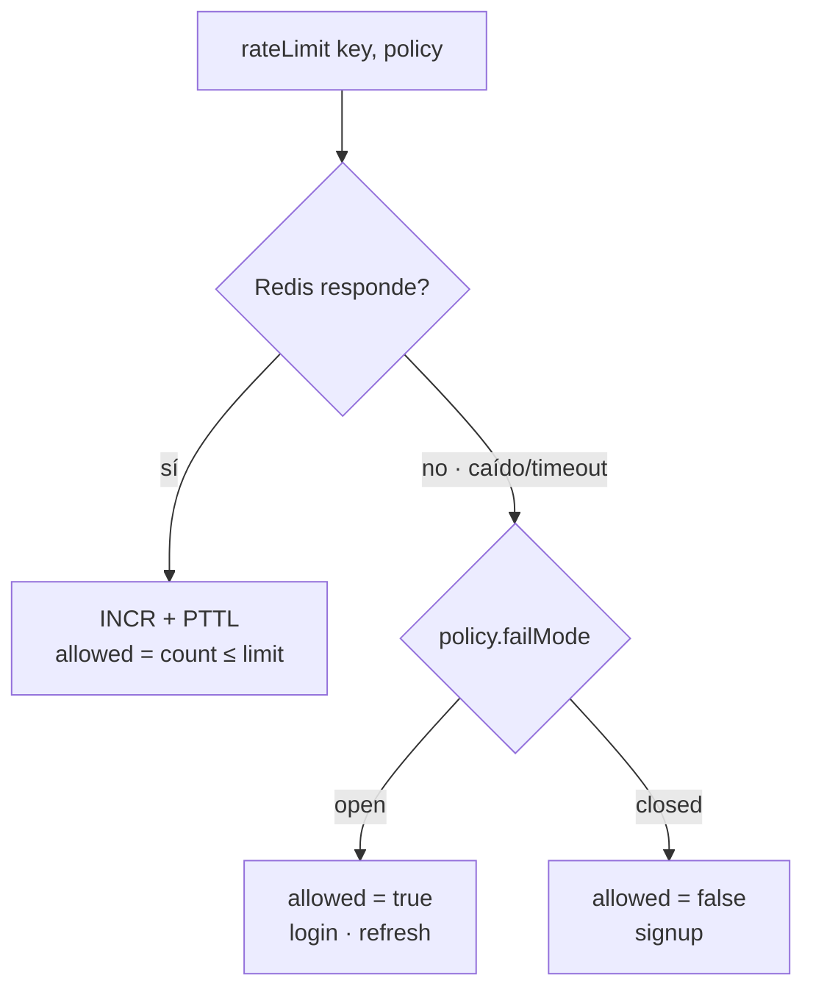

# Rate limiting en el borde público (auth)

- **Estado:** Decidido
- **Fecha:** 2026-07-22
- **Momento:** Pre-deploy (bloque Seguridad); se relaciona con Fase 6 (hardening)
- **Ticket:** [`TD-20`](../tickets/TD-20-rate-limiting.md)
- **Contexto conceptual:** ver [`SECURITY_LAYERS.md`](../insights/SECURITY_LAYERS.md) (capas de seguridad, mecanismo vs. decisión, la IP como clave)

---

## Contexto

Nada limita cuántas veces se pueden llamar las operaciones de autenticación (`authUser`,
`createUser`, `POST /api/auth/refresh`). De cara a un deploy público, eso habilita dos vectores cuyo
daño **no se revierte**:

1. **Fuerza bruta en login → toma de cuentas.** Probar contraseñas contra un email conocido sin
   costo. No tira el server: entra a una cuenta.
2. **Spam de signup → quema de la cuota de Resend y reputación del dominio.** Cada registro corre
   `bcrypt` (lento a propósito) y encola un mail de bienvenida. Un bot con miles de signups quema la
   cuota y —peor— marca el dominio como spam, daño que se recupera lento o no se recupera.

La decisión **no es una sola elección** ("¿rate limiting sí o no?") sino un conjunto de decisiones
sobre **ejes independientes**. Este ADR existe para dejar registrado que cada eje se evaluó con sus
alternativas, no para justificar a posteriori un "fixed window + fail-open" elegido de taquito. Los
ejes:

| Eje | La pregunta |
|---|---|
| **1. Capa** | ¿Dónde se enforza — borde, gateway, aplicación? |
| **2. Estado** | ¿Dónde vive el contador — memoria, Redis, servicio gestionado? |
| **3. Build vs. buy** | ¿A mano, librería o managed? |
| **4. Algoritmo** | ¿Cómo se cuenta — fixed window, sliding, token bucket? |
| **5. Clave** | ¿Por qué se agrupa — IP, cuenta, ambas? |
| **6. Failure mode** | ¿Qué pasa si el contador no está disponible? |

---

## Decisión

De un vistazo, la opción elegida en cada eje y para qué escala vale:

| Eje | Elegido | Alcanza hasta… |
|---|---|---|
| Capa | **Aplicación** | Ataque no distribuido (contador por IP/cuenta) |
| Estado | **Redis compartido** (el que ya existe) | Cualquier nº de instancias de la app |
| Build vs. buy | **A mano** (`INCR`/`PEXPIRE` vía Lua) | Mientras Redis sea la infra de conteo |
| Algoritmo | **Fixed window** | Mientras el *boundary burst* no importe |
| Clave | **login: IP + email** · signup: IP · refresh: IP | Ataque no distribuido |
| Failure mode | **Híbrido**: login/refresh open, signup closed | — |

En concreto:

1. **La cota vive en la aplicación**, adentro de cada operación sensible, antes del trabajo caro
   (antes del `compare()` en login; antes de `bcrypt` y del mail en signup).
2. **El contador vive en Redis** (`lib/redis.ts`, cliente de comandos singleton), no en memoria.
3. **Se implementa a mano** sobre Redis (`lib/rate-limit.ts`): `rateLimit(key, policy)` con
   `INCR` + `PEXPIRE` + `PTTL` atómico vía un script **Lua** (código que Redis corre del lado del
   servidor de una sola vez — ver [Glosario](#glosario)). Sin dependencia nueva.
4. **Algoritmo fixed window**, ventana anclada al primer hit de cada key (el `PEXPIRE` se setea
   cuando el contador nace).
5. **Claves diferenciadas por operación:** login lleva **dos contadores independientes** (`rl:login:ip:*`
   y `rl:login:email:*`); signup y refresh, solo IP. El email se normaliza a minúsculas; la IP sale de
   `x-forwarded-for`.
6. **Failure mode híbrido:** si Redis no responde, login y refresh **dejan pasar** (open) y signup
   **rechaza** (closed). Es un campo `failMode` por política.
7. **Respuesta uniforme:** `ServiceResult` con code `RATE_LIMITED` (→ 429 en HTTP, `TOO_MANY_REQUESTS`
   en GraphQL) y un mensaje genérico **idéntico exista o no el email**, para no volver la cota un
   oráculo de enumeración de cuentas.

---

## Por qué — eje por eje

### Eje 1 — Capa: aplicación

| Opción | Veredicto |
|---|---|
| **Borde (CDN/WAF)** | Frena volumen por IP/ruta, pero **no entiende el dominio**: no sabe qué es un login ni de qué cuenta. Diferido para escala distribuida, no cubre este vector. |
| **Gateway (Nginx)** | Mismo límite semántico. Además, en Next las **Server Actions no tienen URL propia** (todas hacen POST a la ruta de la página) → una regla por ruta no distingue *qué acción* se llama. Y no lo tenemos montado. |
| **Aplicación** | **Elegida.** Es la única capa que puede keyear por cuenta ("N fallos contra *este* email"), que es justo el vector serio. Ver [`SECURITY_LAYERS.md`](../insights/SECURITY_LAYERS.md). |

### Eje 2 — Estado: Redis compartido

| Opción | Veredicto |
|---|---|
| **Memoria del proceso** (`Map`) | O(1) y cero infra, pero **muere al reiniciar** y es **incorrecto con múltiples instancias**: con N réplicas detrás de un balanceador, cada una cuenta lo suyo → deja pasar `N ×` el límite sin avisar. Descartado. |
| **Redis compartido** | **Elegido.** Contador **atómico**, **cross-process** y que **expira solo**. Ya está levantado (BullMQ + adapter de sockets). Es el caso de uso canónico de Redis y le suma una tercera función real. |
| **Servicio gestionado** (Upstash) | Resuelve la gestión de conexiones en **serverless**. Diferido: no estamos en serverless (ver más abajo) y suma una dependencia externa que Redis ya cubre. |

### Eje 3 — Build vs. buy: a mano

| Opción | Veredicto |
|---|---|
| **A mano** (`INCR`/`PEXPIRE` + Lua) | **Elegido.** Redis hace la cota en ~4 comandos; el limitador entero son ~40 líneas sin dependencias. Es el caso de uso canónico y un objetivo de aprendizaje del proyecto. |
| **Librería** (`rate-limiter-flexible`) | Madura y multi-algoritmo, pero es una dependencia nueva para algo que Redis resuelve directo, y esconde el mecanismo que justamente queríamos entender. Descartada. |
| **Managed** (Upstash Ratelimit) | Ver eje 2: útil en serverless, no es nuestro deploy. |

### Eje 4 — Algoritmo: fixed window

| Opción | Cómo cuenta | Veredicto |
|---|---|---|
| **Fixed window** | 1 contador por ventana; `INCR` + expira | **Elegido.** O(1), una key, trivial. Costo asumido: *boundary burst* (ver abajo). |
| **Sliding window log** | Sorted set con el timestamp de cada hit | Preciso y sin burst, pero **O(n) en memoria por key** (guarda cada intento). Overkill para cotas de abuso. Descartado. |
| **Sliding window counter** | Pondera la ventana actual + la previa | Buen punto medio: O(1) y **sin boundary burst**. No lo elegimos porque el burst no nos duele hoy; es un **upgrade barato** si algún día molesta. |
| **Token / leaky bucket** | Balde de tokens con refill a tasa fija | Pensados para **shaping de throughput** (permitir ráfagas + tasa sostenida), no para "cortar fuerza bruta". Más estado sin beneficio acá. Descartado. |

**Qué hace cada algoritmo (en criollo).** Todos responden la misma pregunta —"¿este cliente ya pasó
su cuota?"— pero la miden distinto:

- **Fixed window (ventana fija)** — un contador que se **resetea cada X minutos**. Contás los hits del
  bloque actual; si pasás el límite, cortás hasta que arranca el próximo bloque y el contador vuelve a
  cero. Un número por cliente: lo más simple y barato. *(Es el que usamos.)*
- **Sliding window log (registro deslizante)** — en vez de un contador, guardás la **marca de tiempo
  de cada intento**. Para decidir, contás cuántas caen en los últimos X minutos *hacia atrás desde
  ahora*. La ventana se "desliza" con el tiempo, así que es exacto — pero guardás una entrada por
  intento (la memoria crece con el tráfico).
- **Sliding window counter (contador deslizante)** — el punto medio: mantenés solo **dos contadores**
  (la ventana actual y la previa) y estimás "los últimos X minutos" ponderando la previa por cuánto se
  solapa. Casi tan preciso como el log, pero con dos números en vez de una lista.
- **Token bucket (balde de fichas)** — un balde que se **rellena con fichas a ritmo fijo** (p. ej.
  1/seg, tope 10). Cada request gasta una ficha; sin fichas, se rechaza. Permite **ráfagas** (gastar
  10 juntas) pero impone una **tasa promedio**. Pensado para regular el caudal de una API.
- **Leaky bucket (balde que gotea)** — los requests caen en un balde que **gotea a ritmo constante**;
  si rebalsa, se descartan. Alisa la salida a una tasa fija. Primo del token bucket.

**El *boundary burst* y por qué lo aceptamos:** con fixed window, apenas expira la ventana el cliente
recupera la cuota entera de golpe. Con límite 10/10min, un atacante puede meter 10 al final de una
ventana y 10 al principio de la siguiente → ~20 en pocos segundos. Para *shaping* de una API eso
importaría; para **frenar fuerza bruta, no cambia el modelo de amenaza**: 20 intentos en el borde
siguen chocando contra `bcrypt` (lento) y contra el límite por cuenta. Si alguna vez importa, el
salto a *sliding window counter* es O(1) y no toca a los callers.

### Eje 5 — Clave: IP y cuenta, según la operación

- **Login → dos contadores independientes**, no una key combinada `ip+email`. Si fuera una sola key,
  un ataque distribuido (mil IPs contra un email) generaría mil contadores distintos y ninguno
  llegaría al límite. Separadas: **la de IP** frena el barrido de muchos emails desde una IP; **la de
  email** frena el ataque contra una cuenta desde muchas IPs. Se corta si **cualquiera** se pasa.
- **Signup → solo IP:** el email todavía no existe como cuenta.
- **Refresh → IP:** es la única de las tres que sí es una ruta con URL propia.
- **Normalización:** el email va en minúsculas en la key (si no, variar mayúsculas evade la cota).
- **La IP sale de `x-forwarded-for`**, que el cliente puede falsificar salvo detrás de un proxy de
  confianza que lo reescriba. A esta escala se acepta el caveat (documentado en `SECURITY_LAYERS.md`);
  a escala mayor, la defensa correcta contra IP spoofing / ataque distribuido está en el borde.

### Eje 6 — Failure mode: híbrido

Si Redis no responde, `rateLimit` catchea el error y devuelve `allowed` según el `failMode` de la
política:

Es el trade-off **disponibilidad vs. protección**, y lo resolvimos **distinto por operación** porque
el daño de cada una es distinto:

- **Login/refresh → open.** Que un corte de Redis **no deje a nadie afuera** de la auth. El riesgo de
  abrir es acotado: durante la caída, la fuerza bruta sigue chocando contra `bcrypt` y el unique
  constraint; la cota es una mitigación, no el control de auth. Cerrar login haría de Redis una
  **dependencia dura de la autenticación** — hoy la auth funciona sin Redis, y cerrarla sería una
  regresión de disponibilidad peor que el riesgo que cubre.
- **Signup → closed.** Su daño es **irreversible** (reputación del dominio en Resend). Si Redis no
  puede garantizar la cota, preferimos **no crear la cuenta ni encolar el mail** a arriesgar el
  dominio. Un signup caído un rato es reversible; un dominio marcado como spam, mucho menos.

---

## Qué cambia a otra escala

Este diseño cubre el **100% del riesgo realista a la escala actual** (una app, tráfico modesto,
ataque no distribuido). Los techos, en orden de aparición:

| Si aparece… | El límite es… | El movimiento es… |
|---|---|---|
| **Ataque distribuido** (miles de IPs, pocos intentos c/u) | El contador por IP no lo ve | Correr la cota al **borde**: WAF con reputación de IP, + CAPTCHA en signup, 2FA, bloqueo temporal de cuenta con aviso al dueño |
| **El *boundary burst* molesta** | Fixed window deja pasar ~2× en el cruce | **Sliding window counter** (O(1), sin tocar callers) |
| **Redis se vuelve cuello o SPOF** | Un único Redis para todo | Redis HA/cluster; o contador **local + global aproximado** para bajar round trips |
| **Deploy serverless** (Vercel) | Conexiones TCP efímeras se agotan | **Upstash** (Redis por HTTP) o reuso agresivo del cliente entre warm starts |

Sobre el **SPOF de Redis**: hoy es aceptable porque el `failMode` ya decide el comportamiento ante su
caída (eje 6). No lo blindamos con HA todavía porque a esta escala el costo operativo no se paga.

---

## Alternativas consideradas (resumen)

| Opción | Eje | Veredicto |
|---|---|---|
| Rate limit en el borde (WAF) | Capa | Diferido: no entiende semántica de cuenta; entra a escala distribuida |
| Rate limit en Nginx | Capa | Descartado: Server Actions sin URL + no está montado |
| Contador en memoria del proceso | Estado | Descartado: muere al reiniciar, incorrecto multi-instancia |
| Redis compartido | Estado | **Elegido**: atómico, cross-process, expira solo, ya existe |
| Upstash (managed) | Estado | Diferido: para serverless, no es nuestro deploy |
| `rate-limiter-flexible` | Build/buy | Descartada: dependencia para lo que Redis hace en 4 comandos |
| **Fixed window** | Algoritmo | **Elegido**: O(1), simple; boundary burst asumido |
| Sliding window log | Algoritmo | Descartado: O(n) memoria por key |
| Sliding window counter | Algoritmo | Upgrade diferido: barato si el burst molesta |
| Token/leaky bucket | Algoritmo | Descartado: sirve para shaping de throughput, no para frenar brute force |
| Key combinada `ip+email` | Clave | Descartada: rompe el freno al ataque distribuido |
| Fail-open global | Failure mode | Parcial: lo usamos en login/refresh, no en signup |
| Fail-closed global | Failure mode | Descartado para login/refresh: haría de Redis dependencia dura de la auth |

---

## Consecuencias

**Positivas**
- Le suma a Redis una **tercera función real** (contador atómico compartido) sin infra ni dependencia
  nueva.
- **Correcto con cualquier nº de instancias** de la app (el estado no vive en el proceso).
- El contador **expira solo** y **sobrevive al reinicio** de la app.
- Respuesta uniforme por el contrato `ServiceResult` existente: `RATE_LIMITED` → 429 / `TOO_MANY_REQUESTS`,
  sin filtrar existencia de cuentas.

**Asumido a propósito**
- **Boundary burst** del fixed window (eje 4): no cambia el modelo de amenaza a esta escala.
- **La IP depende de un proxy de confianza** en el deploy; sin él, `x-forwarded-for` es falsificable.
  Si no hay header, la IP cae a `"unknown"` (un bucket compartido) — aceptable local, a vigilar en prod.
- **Redis como SPOF**, mitigado por el `failMode` explícito en vez de blindaje HA.

**Negativas / deuda**
- Una **conexión Redis más** (el cliente de comandos, aparte del subscriber de SSE y de BullMQ).
- Los **números de política** (10/5/30, ventanas) se eligieron sin datos de tráfico real: son un punto
  de partida razonable, a tunear con métricas.
- **Reset-on-success** en login: un login OK libera los contadores. Si un atacante adivina la
  contraseña, el reset le da una ventana nueva — irrelevante, porque a esa altura ya entró.

---

## Glosario

- **Atómico** — una operación que ocurre "todo o nada", sin estados intermedios visibles y sin que
  otra se intercale en el medio. Es lo que evita que dos requests concurrentes pisen el mismo contador.
- **`INCR` / `PEXPIRE` / `PTTL`** — comandos de Redis: `INCR` suma 1 al contador (y lo crea en 0 si no
  existía); `PEXPIRE` le pone a la key un vencimiento en milisegundos (se borra sola al llegar a cero);
  `PTTL` devuelve cuántos ms le quedan de vida.
- **Lua** — un lenguaje de scripting minúsculo que Redis ejecuta **del lado del servidor y de forma
  atómica**: le mandás un script y lo corre entero sin que otro comando se meta en el medio. Lo usamos
  para que `INCR` + `PEXPIRE` + `PTTL` cuenten como una sola operación indivisible, en un round trip.
- **Round trip** — un viaje de ida y vuelta app ↔ Redis (mandar comando, recibir respuesta). Menos
  round trips = menos latencia; el script Lua hace las tres operaciones en uno.
- **Boundary burst (ráfaga de borde)** — el agujero del fixed window: como el contador se resetea de
  golpe al terminar la ventana, un cliente puede gastar toda la cuota justo antes del reset y toda de
  nuevo justo después → hasta 2× el límite en un instante, en el "borde" entre ventanas. Detalle en el
  Eje 4.
- **SPOF (single point of failure)** — una pieza cuya caída voltea toda la función. Redis es el SPOF de
  la cota: si se cae, no hay contador (de ahí el `failMode`).
- **Cold / warm start** — en serverless, un *cold start* arranca un proceso nuevo desde cero (sin
  conexiones abiertas); un *warm start* reusa uno ya "caliente" de un request anterior. Importa para no
  reabrir la conexión a Redis en cada invocación.
- **WAF · CAPTCHA · 2FA** — defensas del borde/producto: WAF = *Web Application Firewall* (filtra
  requests HTTP antes de tu app); CAPTCHA = prueba "¿sos humano?"; 2FA = segundo factor de login,
  además de la contraseña.
