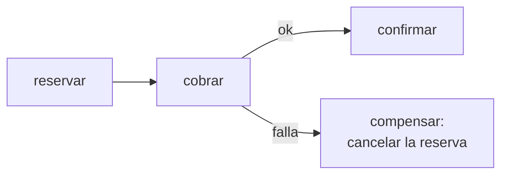

# OUTBOX_AND_SAGA.md

Referencia conceptual sobre dos patrones que suelen confundirse: **outbox** (entrega de eventos) y
**saga** (coordinación de un flujo distribuido). Es la teoría; cómo se producen y consumen los jobs
hoy en este proyecto vive en el ADR [`BULLMQ_QUEUES.md`](../architecture/BULLMQ_QUEUES.md).

> **Outbox está implementado** para los efectos de bookings y del alta de usuario; el cableado concreto
> (tabla, relay, fan-out) vive en [`BULLMQ_QUEUES.md`](../architecture/BULLMQ_QUEUES.md). Saga no, y
> hoy no aplica: ningún flujo de la app tiene un paso que haya que compensar.

---

## Outbox

No es una tabla temporal ni "guardo para reintentar". Es: **la fila del outbox se escribe en la misma
transacción que la entidad.**

```sql
BEGIN
  INSERT INTO bookings (...);
  INSERT INTO outbox   (...);  -- "hay que publicar esto"
COMMIT;
```

Un solo commit, un solo sistema. O quedan las dos filas o ninguna — es imposible que exista una
reserva sin su pendiente de publicación.

Después, un proceso aparte lee las filas no publicadas, las encola y las marca. Esa es la parte de
retry — pero es **consecuencia**, no el mecanismo. Lo que hace correcto al patrón es que el "tengo que
mandar este mail" pasa a ser un hecho **commiteado y durable**, con la misma garantía que la reserva.
Sin outbox ese hecho sólo vive en una variable de un proceso que se puede morir.

---

## Saga

Una transacción de negocio que cruza varios servicios, partida en **N transacciones locales**, cada
una con su **compensación** (un deshacer de negocio, no un rollback).



Si el paso 2 falla, no hay rollback posible (el paso 1 ya commiteó en otra DB), así que ejecutás la
acción inversa. No "deshacés" — hacés algo nuevo que anula el efecto.

---

## La diferencia en una línea

| Patrón | Resuelve | Problema de… |
|---|---|---|
| **Outbox** | Cómo publico un evento sin que se pierda | *Entrega* |
| **Saga** | Cómo mantengo consistente un flujo de varios pasos que puede fallar a la mitad | *Coordinación* |

No son alternativas: **se combinan.** Una saga no resuelve el dual-write — lo tiene en cada paso (cada
participante commitea su estado local y después emite el evento del siguiente). Por eso cada paso de
una saga usa outbox para emitir su evento.
