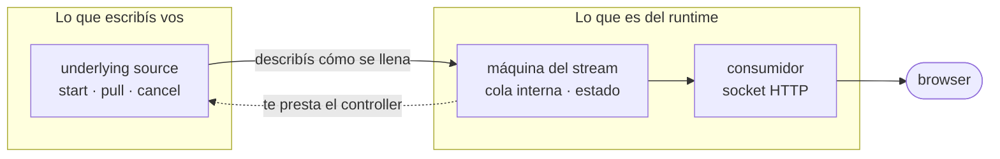
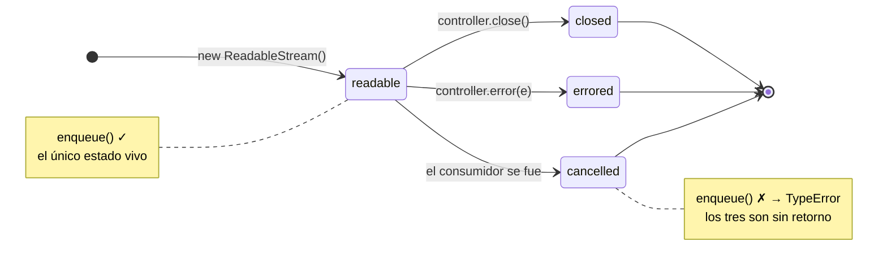
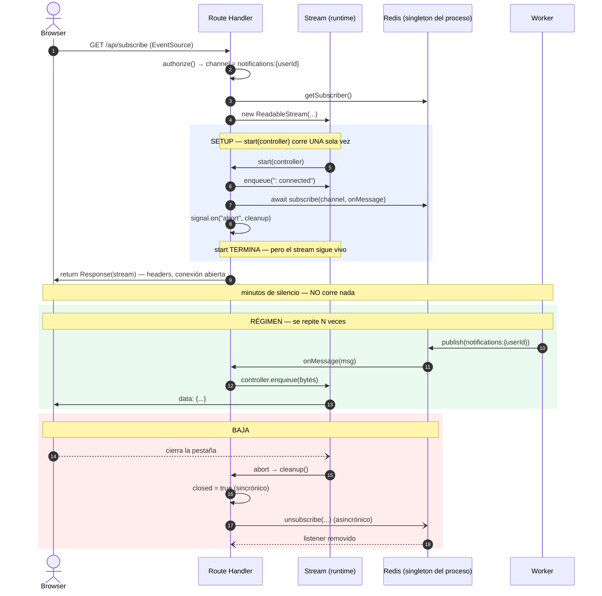
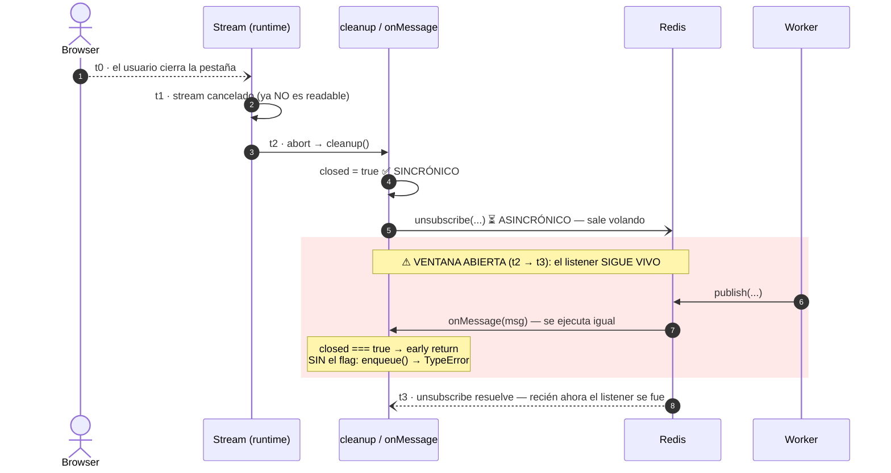

# READABLE_STREAMS.md

Guía foundational sobre `ReadableStream`: qué es un *controller*, quién es dueño de qué, y cómo se sigue el ciclo de vida completo de un stream de larga duración.

> **Prerequisito de:** `TEXT_ENCODING.md` §6 (nuestra implementación SSE en `app/api/subscribe/route.ts`). Si esa sección te resulta densa, empezá por acá.

---

## 1. El modelo mental: no sos dueño del stream

Este es el punto que hace clic y ordena todo lo demás:

> **Vos no controlás el stream. El runtime lo controla. Vos solo describís cómo se llena.**

Cuando hacés `new ReadableStream({...})`, el objeto que le pasás **no es el stream**. Es una *underlying source*: una bolsa de callbacks que el runtime va a invocar **cuando él decida**. El stream real es una máquina que vive adentro del runtime, con su propia cola interna, su propio estado y su propio consumidor (el socket HTTP, que ni ves).

Es una relación invertida respecto a lo que uno espera. No llamás al stream: **el stream te llama a vos**, y te presta un `controller` para que le pases datos.

---

## 2. Los dos objetos que tenés que distinguir

Casi toda la confusión inicial viene de mezclar estos dos:

| Objeto | Qué es | Quién lo crea | Cuándo lo usás |
| :--- | :--- | :--- | :--- |
| **Underlying source** | El objeto literal `{ start, pull, cancel }` que escribís vos | Vos | Al construir el stream |
| **Controller** | El control remoto que te pasa el runtime como argumento | El runtime | Adentro de los callbacks |

El **controller** es la única forma que tenés de tocar el stream. Y es deliberadamente mínimo:

| Miembro | Qué hace |
| :--- | :--- |
| `enqueue(chunk)` | Mete un chunk (un `Uint8Array`) en la cola interna |
| `close()` | Termina la respuesta. No hay vuelta atrás |
| `error(e)` | Rompe el stream con un error. Tampoco hay vuelta atrás |
| `desiredSize` | Cuántos chunks más "quiere" la cola (backpressure) |

**Eso es todo.** Cuatro miembros. Guardá esta lista, porque en la sección 6 vamos a volver sobre lo que **no** está acá.

---

## 3. Los tres callbacks del ciclo de vida

### `start(controller)` — el setup

Corre **una sola vez**, sincrónicamente, apenas construís el stream. Acá:

*   Recibís el `controller` por primera vez.
*   Encolás lo que quieras mandar de entrada.
*   **Registrás quién va a encolar en el futuro.**

Ese último punto es el que más cuesta. **`start` no es "el loop que manda datos", es el setup.** Podés terminar `start` y el stream sigue perfectamente vivo: el runtime no lo cierra hasta que alguien llame a `close()`/`error()`, o hasta que el consumidor cancele.

### `pull(controller)` — "quiero más" (no lo usamos)

El runtime lo llama cuando su cola interna se vacía y quiere más datos. Sirve para **fuentes pull**: datos que vos podés producir a demanda (leer un archivo, paginar una API).

Nuestro caso es una **fuente push**: los datos llegan cuando Redis quiere, no cuando el consumidor pide. Nadie puede "pedirle" una notificación al usuario. Por eso no hay `pull` en `subscribe/route.ts` — no habría nada que hacer adentro.

| Tipo de fuente | Quién marca el ritmo | Callback |
| :--- | :--- | :--- |
| **Pull** (archivo, API paginada) | El consumidor | `pull` |
| **Push** (Redis pub/sub, WebSocket, eventos) | La fuente externa | `start` + `enqueue` desde un callback |

### `cancel(reason)` — el consumidor se fue

El runtime lo llama cuando el **consumidor** abandona: el usuario cerró la pestaña, navegó a otra página, se cortó la red. Es la notificación oficial de "esto se terminó, soltá tus recursos".

> **Ojo:** `cancel` es para cuando *el otro lado* corta. Si vos llamás `controller.close()`, `cancel` **no** se ejecuta — vos ya sabías que terminaste.

---

## 4. La máquina de estados

Un stream tiene tres estados, y **solo se sale de `readable` una vez**. No hay reapertura.

La regla dura, confirmada por [MDN](https://developer.mozilla.org/en-US/docs/Web/API/ReadableStreamDefaultController/enqueue):

> Se lanza un `TypeError` si se llama a `enqueue()` cuando el stream no es *readable* — porque ya está cerrado, cancelado o con error.

**Encolar en un stream muerto es una excepción, no un no-op.** Todo el diseño de la sección 7 existe por esta única línea.

---

## 5. El ciclo de vida completo de nuestro SSE

Ahora sí, la línea de tiempo real de `app/api/subscribe/route.ts`, de punta a punta:

Fijate el bloque azul del **setup**: `start` termina ahí mismo, pero el primer dato recién aparece en el bloque verde. Entre medio no corre **nada**. El stream está vivo pero dormido, y lo único que lo mantiene así es que nadie llamó a `close()`.

---

## 6. Por qué `closed` no puede vivir en el controller

Volvamos a la lista de la sección 2. El controller tiene `enqueue`, `close`, `error` y `desiredSize`. **No tiene `.closed`, ni `.state`, ni `.readable`, ni ningún evento.**

No es un olvido de la spec, es una decisión de diseño: **el controller es un control remoto de una sola dirección.** Sirve para *empujar*, no para *preguntar*. El runtime asume que si vos tenés el controller, vos sabés en qué estado está tu propio stream, porque vos sos quien lo cierra.

Esa suposición se rompe exactamente en nuestro caso: **el stream lo cerró otro** (el runtime, porque el usuario se fue), y no hay forma de enterarse mirando el controller.

### ¿Y `desiredSize` no sirve?

No, y vale entender por qué, porque es la trampa obvia. `desiredSize` mide **backpressure**, no vida:

*   Devuelve `null` si el stream tiene error.
*   Devuelve `0` si está cerrado…
*   …pero **también** devuelve `0` cuando el stream está perfectamente vivo y la cola simplemente está llena.

Un `0` es ambiguo: no distingue "está muerto" de "está sano pero saturado". Es la métrica equivocada para la pregunta.

### ¿Y no puedo simplemente hacer `try/catch`?

Podrías: `enqueue` tira `TypeError`, lo atrapás y listo. Funciona. Pero:

*   Convierte una condición **esperada y normal** (todo usuario cierra la pestaña alguna vez) en control de flujo por excepción.
*   Es reactivo: te enterás *después* de intentar, cuando ya sabías la respuesta desde el paso 18.

Un booleano es más barato, más explícito y se lee mejor. Pero que quede claro: **el `try/catch` no está mal, es una alternativa legítima.** El flag es una preferencia de estilo sobre ese punto.

---

## 7. Por qué `closed` tampoco puede vivir en Redis

Acá la razón es más dura, y no es una preferencia:

> **El cliente Redis es un singleton compartido por todo el proceso** (`lib/subscriber.ts`).

Una conexión, N usuarios conectados, N streams. El estado del cliente Redis es "estoy conectado a Redis" — un hecho **global**. El estado que necesitamos es "la pestaña de *este* usuario se fue" — un hecho **por request**.

Un objeto compartido no puede alojar estado por request. Si `closed` viviera en el cliente Redis, el primer usuario que cerrara la pestaña lo marcaría para todos.

---

## 8. Entonces, ¿dónde vive `closed`? (la respuesta)

La sensación de que "vive afuera de ambos mundos" es entendible, pero es al revés. `closed` **sí tiene una casa**, y es la correcta:

> **`closed` vive en la clausura de `start`, que es exactamente el scope del request.**

Cada `GET /api/subscribe` ejecuta `start` de nuevo y crea una clausura nueva. No es una variable global: **hay un `closed` por pestaña conectada**, y muere con ella. Es el único scope que cumple las dos condiciones:

1.  Es **por request** (a diferencia del cliente Redis, que es del proceso).
2.  Es **alcanzable desde los dos callbacks** que necesitan coordinarse — `onMessage` y `cleanup` — porque ambos se definen adentro.

Poné los tres dueños uno al lado del otro y se ve solo:

| Ciclo de vida | Dueño | Alcance | Te avisa vía |
| :--- | :--- | :--- | :--- |
| **El request** | Browser + runtime | Por request | `req.signal` → `abort` |
| **El stream** | Runtime | Por request | `cancel()` — y nada más |
| **La suscripción** | Singleton Redis | **Por proceso** | nada |

Los tres se terminan por la misma causa (el usuario se fue), pero **ninguno le avisa a los otros dos**. `closed` es la variable que los une: el request avisa, `closed` lo registra, y `onMessage` lo consulta antes de tocar el stream.

No es un parche. Es la traducción de un hecho ("esta sesión terminó") a un lugar donde los tres mundos puedan verlo.

---

## 9. La ventana de carrera (por qué el flag es sincrónico)

Falta la última pieza: ¿por qué no alcanza con `unsubscribe` y ya?

**Porque `unsubscribe` es asincrónico.** Es un round-trip a Redis. Devuelve una Promise. Y hasta que esa Promise no resuelve, **el listener sigue registrado y Redis puede seguir entregando mensajes**.

La ventana `t2 → t3` dura lo que tarde Redis en responder. Milisegundos… hasta que Redis esté lento o el proceso bajo carga.

**`closed = true` se ejecuta sincrónicamente en `t2`**, antes de que el `await` ceda el control. Cualquier `onMessage` que caiga en la ventana ve `closed === true` y hace un early return. Esa es toda la función del flag: **cubrir el hueco entre un evento sincrónico (el abort) y una limpieza asincrónica (el unsubscribe).**

### Y si no estuviera, ¿qué pasa?

No es cosmético. El `TypeError` se lanzaría **adentro de un callback de evento de node-redis**, no dentro de tu `try/catch` ni de tu handler:

*   Nadie lo atrapa → excepción no manejada.
*   Peor: ocurre en la pila del **cliente Redis compartido**. El radio de explosión no es la pestaña que se fue: es **el proceso entero y todos los usuarios conectados**.

Esa asimetría es la que justifica el flag. Cuesta una línea; el fallo cuesta a todos.

---

## 10. Resumen

*   El runtime es dueño del stream. Vos solo describís cómo se llena (`start`/`pull`/`cancel`).
*   `start` es **setup**, no un loop. Termina, y el stream sigue vivo.
*   Fuente **push** (Redis) → encolás desde un callback externo, no desde `pull`.
*   Salir de `readable` es de una sola vía: después, `enqueue` **tira `TypeError`**.
*   El controller es un control remoto de una sola dirección: **empuja, no informa**.
*   `closed` no vive en el controller (no lo expone), ni en Redis (es compartido). Vive en la **clausura del request**, que es el único scope por-request visible desde los dos callbacks.
*   Es **sincrónico** porque tapa la ventana que abre un `unsubscribe` asincrónico.

---

## Referencias

*   [MDN — `ReadableStream`](https://developer.mozilla.org/en-US/docs/Web/API/ReadableStream)
*   [MDN — `ReadableStreamDefaultController`](https://developer.mozilla.org/en-US/docs/Web/API/ReadableStreamDefaultController)
*   [MDN — `enqueue()` y su `TypeError`](https://developer.mozilla.org/en-US/docs/Web/API/ReadableStreamDefaultController/enqueue)
*   [WHATWG — Streams Standard](https://streams.spec.whatwg.org/)
*   [web.dev — Streams API](https://web.dev/articles/streams)
*   Continúa en: `TEXT_ENCODING.md` §6 — por qué los chunks son bytes y no strings
*   Implementación: `app/api/subscribe/route.ts`, `lib/subscriber.ts`
