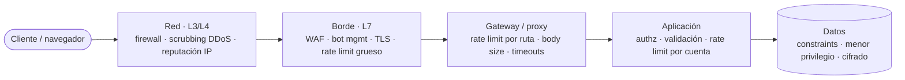
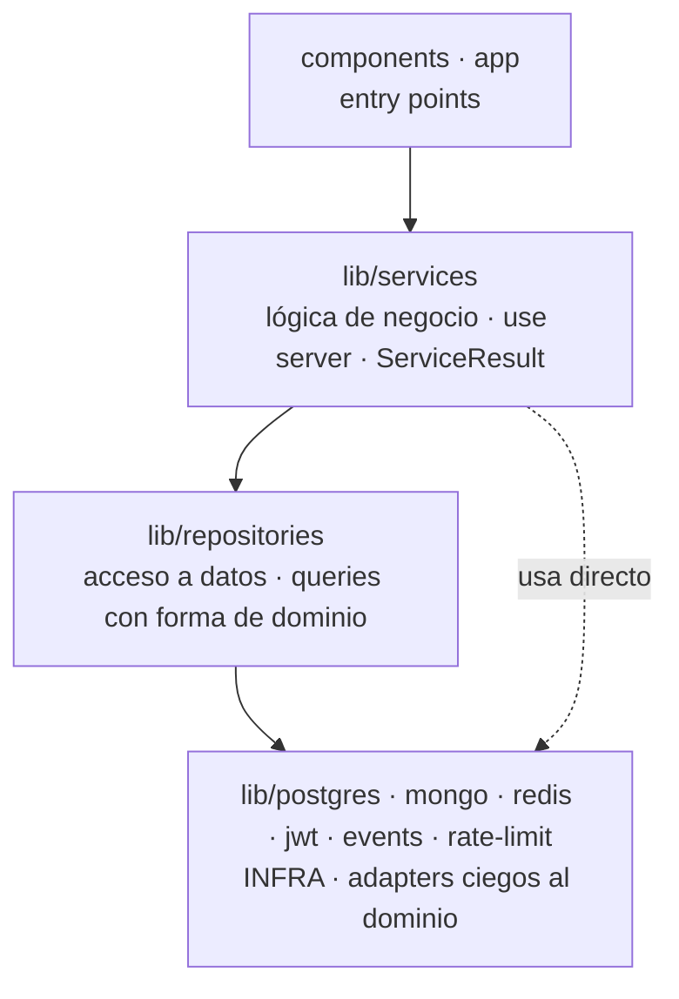

# Capas de seguridad — dónde vive cada control

> Nota conceptual, agnóstica a la implementación. Explica **dónde** se aplican los controles de
> seguridad de una app web —de la red al dato— y por qué el rate limiting es *un* control en *una*
> capa, no toda la historia. Contexto para [`TD-20`](../tickets/TD-20-rate-limiting.md) (rate
> limiting) y [`TD-21`](../tickets/TD-21-graphql-limits.md) (límites de GraphQL).

---

## La idea: defensa en profundidad

Un request viaja de afuera hacia adentro cruzando varias fronteras antes de tocar tus datos. En cada
frontera podés poner un control. La seguridad no es **una** pared: es una serie de filtros, cada uno
atrapando lo que el anterior no puede ver. Que uno falle no abre todo lo demás.

La regla que organiza todo el gradiente:

- **Cuanto más afuera:** más barato, más grueso, más **volumétrico**. Frena mucho tráfico sin
  entender nada de tu dominio.
- **Cuanto más adentro:** más caro, más fino, más **semántico**. Entiende qué es un login, de quién
  es este recurso, qué operación se está pidiendo.

Las capas **no compiten** — resuelven problemas distintos y se suman. Un WAF nunca va a saber que
estos 6 requests son 6 contraseñas contra la misma cuenta; tu código nunca va a frenar un flood de
red de 10 Gbps. Ninguna reemplaza a la otra.

---

## Las capas

| Nivel | Dónde vive | Qué ve | Controles típicos |
|---|---|---|---|
| **Red (L3/L4)** | Proveedor cloud | Paquetes, conexiones TCP | Firewall, scrubbing de DDoS, reputación de IP |
| **Borde (L7)** | CDN / WAF | Requests HTTP (sin dominio) | Reglas WAF, bot management, geo-block, TLS, rate limit grueso |
| **Gateway / proxy** | Nginx, API gateway | Requests HTTP por ruta | Rate limit por ruta, límite de tamaño de body, timeouts, terminación TLS |
| **Aplicación** | Tu código | Semántica de negocio | Authz + ownership, validación, rate limit por cuenta, sanitización |
| **Datos** | La DB | Acceso al dato | Constraints, usuario de menor privilegio, RLS, cifrado en reposo |

---

## Rate limiting no es la única medida pre-deploy

La cota es un control de la categoría **abuso / disponibilidad**. Pero un deploy público honesto mira
varias categorías a la vez — cada una ataca un vector distinto y aterriza en una capa distinta:

| Categoría | Qué ataca | Capa | Control |
|---|---|---|---|
| **Transporte** | Sniffing, MITM | Borde | TLS/HTTPS, HSTS |
| **AuthN / AuthZ** | Acceso indebido a recursos | App | Verificar identidad **y** ownership en cada operación |
| **Injection** | SQLi, XSS, inyección de comandos | App (+ WAF) | Queries parametrizadas, escape de output, CSP |
| **Validación de input** | Datos corruptos o maliciosos | App | Validar en el server; nunca confiar en el cliente |
| **Abuso / disponibilidad** | Fuerza bruta, spam, DoS | Borde + App | **Rate limiting**, límites de complejidad/tamaño |
| **Fuga de información** | Leak de detalles internos | App | Mensajes genéricos; nunca reenviar el error crudo de la DB |
| **Secretos** | Credenciales expuestas | Infra | Env vars fuera del repo, rotación |
| **Headers de seguridad** | Clickjacking, XSS | Borde / App | CSP, X-Frame-Options, HSTS |

La cota, entonces, es una casilla de una fila de una tabla. Importante, pero una entre varias.

---

## Rate limiting vive en dos capas

La cota aparece **dos veces** en el gradiente, y son cosas distintas que se complementan:

- **En el borde (grueso):** *"esta IP mandó 5000 requests a esta ruta en 10 s"*. Barato, a escala,
  frena floods. Clave: IP / ruta. No entiende tu dominio.
- **En la app (semántico):** *"este email lleva 5 contraseñas fallidas, aunque cada intento venga de
  una IP distinta"*. Solo lo puede hacer quien sabe qué es un login. Clave: email, user, acción.

Por qué el semántico **no** se puede delegar al borde:

1. **Semántica.** "Freno la fuerza bruta *contra esta cuenta*" es una regla que necesita conocer el
   dominio. El WAF ve HTTP, no cuentas.
2. **En Next, las Server Actions no tienen URL propia.** Todas hacen `POST` a la ruta de la página
   que las importa; el framework distingue *qué acción* se llama por un header interno. Una regla de
   borde por ruta no puede separarlas → el límite tiene que vivir **adentro** de la operación, no
   delante de ella.

> **Regla mental:** el borde frena el **volumen**; la app frena el **abuso con nombre y apellido**.
> La cota por IP y la cota por cuenta son controles distintos contra vectores distintos — por eso el
> login lleva las dos: la IP frena el barrido de muchos emails, el email frena el ataque distribuido
> contra una cuenta puntual.

---

## Dentro de la app: mecanismo vs. decisión

La capa de app es donde vive la cota semántica. Pero **adentro** de la app hay otro corte, y es el
que decide en qué archivo vive cada parte.

**Posición vs. capa.** El limitador se llama al tope de la operación, antes del trabajo caro — misma
posición que un guard como `authorize()`. Pero posición no es capa:

- `authorize()` es **lógica de negocio**: sabe de usuarios, permisos y roles; devuelve `ServiceResult`.
- El limitador es un **mecanismo**: un contador en Redis; no sabe qué es un login, ni un email, ni un
  usuario.

Por eso el limitador **no es un service**. Los services (`lib/services/*`) son `"use server"`,
devuelven `ServiceResult` y encodean reglas de dominio. El limitador es una utilidad de **infra** que
el service *usa*.

**Qué es "infra".** La banda de abajo del layering: adapters sobre un sustrato técnico, **ciegos al
dominio**. Mueven filas / tokens / contadores / bytes, pero no saben qué es una reserva ni un listing.

| Archivo | Sustrato | ¿Sabe de dominio? |
|---|---|---|
| `lib/postgres.ts` · `lib/mongo.ts` | PostgreSQL / MongoDB | No |
| `lib/jwt.ts` | crypto (firma/verifica tokens) | No |
| `lib/events.ts` · `lib/redis.ts` | Redis / BullMQ | No |
| **`lib/rate-limit.ts`** | Redis (`INCR`/`EXPIRE`) | **No** |

El limitador entra ahí, al lado de `jwt.ts` y `redis.ts`. Concretamente: **no lleva `"use server"`**
(nunca lo llama el cliente directo; corre dentro de código que ya está en el server), **no devuelve
`ServiceResult`** (devuelve `{ allowed, retryAfterMs }`) y **no conoce auth** (recibe una clave string
y una política).

**El corte que lo explica.** Es la misma regla de *"codificar qué valores de dominio cuentan va en el
service, no en el repo"*, generalizada:

| | Mecanismo (infra) | Decisión (service) |
|---|---|---|
| **authorize** | ¿el set de permisos del user incluye la clave K? | esta operación exige la clave K |
| **rate-limit** | contá la clave K bajo la política P → permitido/denegado | login keyea por IP+email, límite 10/5, y traduce el denegado a un mensaje friendly |

El limitador dice "permitido/denegado"; el **service** decide **qué clave**, **qué límite** y
**cuándo cortar**, y traduce el denegado a un `ServiceResult` con el mensaje friendly (el mismo para
email real e inexistente). El limitador es al service lo que un repo es al service: la pieza de abajo
que hace el trabajo mecánico; el service pone la semántica y el contrato hacia arriba.

> **Regla mental:** el mecanismo no toma decisiones de dominio, y el que decide no toca el sustrato.
> Si para cambiar una regla de negocio tenés que editar la pieza de infra, la regla estaba en el lugar
> equivocado.

---

## La IP como clave: útil, pero no una bala de plata

Keyear por IP es la práctica estándar de primera línea, pero es *una señal*, no *la* señal:

- **NAT / CGNAT** — mucha gente real comparte una IP (oficina, universidad, carrier móvil). Un
  límite por IP demasiado ajustado bloquea inocentes.
- **IPv6** — un atacante suele tener un bloque `/64` gratis y rota direcciones sin esfuerzo. Contar
  por IP exacta es débil; lo correcto es agrupar por prefijo.
- **Ataque distribuido** — miles de IPs con pocos intentos cada una pasan por debajo del contador.
  Eso ya es trabajo del borde (reputación de IP, WAF), no de la app.
- **Confianza en el header** — la IP se lee de `X-Forwarded-For`, y **ese header lo puede falsificar
  el cliente**. Solo es confiable si hay un proxy de confianza adelante (Nginx, Vercel, Cloudflare)
  que lo reescribe. Sin eso, un atacante manda una IP inventada por request y evade la cota entera —
  o mete la IP de otro para que lo bloqueen a él.

Conclusión que se traduce al diseño: usar IP sí, pero sabiendo que su valor real aparece
**combinada** con un identificador de dominio, y que su confiabilidad depende de tener un proxy de
confianza en el borde.

---

## Cómo aplica en este proyecto

- **[TD-20](../tickets/TD-20-rate-limiting.md)** — rate limiting a nivel app sobre el Redis que ya
  existe (`INCR` + `EXPIRE`): login (IP **y** email), signup (IP), refresh (IP). La justificación
  completa de la decisión (ejes, alternativas, escalas) está en el ADR
  [`RATE_LIMITING.md`](../architecture/RATE_LIMITING.md).
- **[TD-21](../tickets/TD-21-graphql-limits.md)** — límites de profundidad/complejidad de query en
  GraphQL: otro vector de disponibilidad que el rate limit por IP no cubre (una query anidada
  también tumba el server).
- **Fuera de alcance (capa de borde):** WAF, protección de DDoS, CAPTCHA. Entran recién si el riesgo
  escala a ataque distribuido, que un contador por IP no frena. A la escala de este proyecto, la cota
  en Redis cubre el 100% del riesgo realista.
