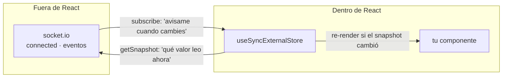
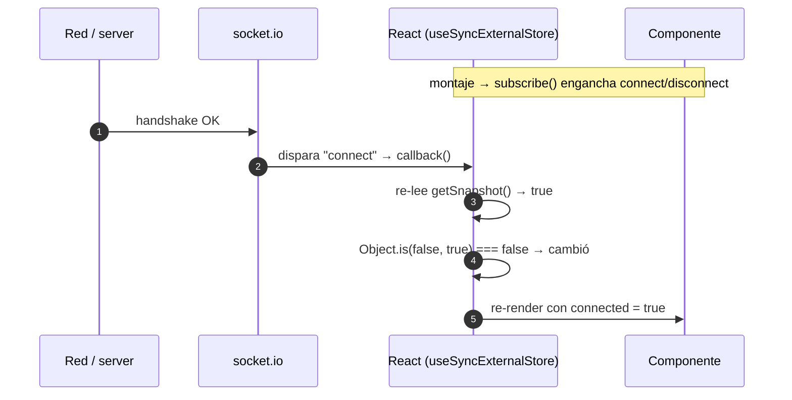

# USE_SYNC_EXTERNAL_STORE.md

Guía foundational sobre `useSyncExternalStore`: qué problema resuelve, sus tres argumentos, y el detalle sutil de `Object.is` que decide **qué** tenés que devolver. Anclado a nuestro hook de socket en `components/chat/use-booking-chat.ts`.

> **Contexto:** apareció cablando el chat en tiempo real. El socket vive fuera de React y su estado (`connected`) cambia por eventos de red. Este hook es el puente oficial de React para eso.

---

## 1. El modelo mental: React vive adentro, el socket vive afuera

Este es el punto que ordena todo lo demás:

> **El estado de React vive dentro de React. Tu socket vive afuera.**

`socket.connected` cambia por eventos de red — el server responde el handshake, se cae la conexión — cosas que ocurren **completamente fuera de React**. Si en el render hacés `socket?.connected === false`, React no tiene forma de enterarse de cuándo eso cambia, así que **no re-renderiza**. La UI queda congelada en el valor del primer render.

`useSyncExternalStore` es el hook nativo de React (18+) que traduce un sistema externo y mutable a algo que React sabe observar. Casi nunca lo escribís a mano: vive escondido dentro de librerías (Redux, Zustand, `react-query` lo usan por debajo). Lo tocás directo solo cuando te suscribís a un sistema externo crudo — un socket, `window.matchMedia`, `localStorage`, `navigator.onLine`.



---

## 2. Los tres argumentos

```ts
const value = useSyncExternalStore(subscribe, getSnapshot, getServerSnapshot);
```

| Argumento | Qué hace | En nuestro `useSocket` hoy |
| :--- | :--- | :--- |
| `subscribe(callback)` | React te pasa un `callback`. Vos lo enganchás a los eventos del sistema externo. Cada vez que algo cambia afuera, llamás `callback()` → React re-lee el snapshot y re-renderiza si cambió. **Devuelve una función de cleanup** (des-suscribir). | `() => () => {}` → **no-op**: no escucha nada todavía. |
| `getSnapshot()` | Devuelve el valor actual que React debe usar. **Tiene que ser referencialmente estable** si nada cambió, o entra en loop infinito (ver §3). | `() => getSocketConnection()` → el singleton (misma instancia siempre = estable ✓). |
| `getServerSnapshot()` | Valor durante SSR e hidratación inicial. Sin esto, un componente cliente que use el hook rompe en SSR. | `() => null` → no hay socket en el server (ver §5). |

El modelo mental de los dos primeros, en una línea:

> `subscribe` = **"cómo me entero de que cambió"**. `getSnapshot` = **"qué valor leo cuando me entero"**.

---

## 3. El detalle sutil: `getSnapshot` devuelve el VALOR, no el objeto

Acá está la trampa que hace que "devolver el socket" no alcance para trackear `connected`.

Cuando llamás `callback()`, React vuelve a llamar `getSnapshot()` y compara el nuevo valor con el anterior usando **`Object.is`**. Si son iguales, **no re-renderiza**. Dos consecuencias:

1. **Si `getSnapshot` devuelve algo nuevo en cada llamada** (un objeto/array literal recién creado), `Object.is` siempre da `false` → React cree que cambió siempre → **loop infinito**. Por eso el snapshot tiene que ser estable.
2. **Si `getSnapshot` devuelve siempre el mismo objeto mutable**, `Object.is` siempre da `true` → React nunca ve el cambio, aunque una propiedad interna haya mutado.

Nuestro `useSocket` cae en el caso 2, y **está bien** para lo que hace hoy:

```ts
// use-booking-chat.ts
const socket = useSyncExternalStore(
  subscribe,                    // no-op
  () => getSocketConnection(),  // SIEMPRE el mismo objeto singleton
  () => null,
);
```

El socket es siempre la misma instancia; su identidad nunca cambia; no hay nada que re-renderizar. Un `subscribe` vacío alcanza y podés `socket.emit(...)` sin drama.

**El problema aparece cuando querés `connected` reactivo.** Cuando el socket pasa de desconectado a conectado, `getSocketConnection()` devuelve **el mismo objeto** — la identidad no cambia porque solo mutó `socket.connected` de `false` a `true`. `Object.is(mismoSocket, mismoSocket)` es `true` → React no re-renderiza. **Devolver el objeto no sirve para trackear un booleano interno.**

> **La regla:** `getSnapshot` tiene que devolver **el valor primitivo que te importa** (el booleano, el status string), no el objeto mutable que lo contiene.

---

## 4. Cómo se configura para `connected` reactivo

De §3 sale el diseño: **separar dos preocupaciones**.

| Preocupación | Qué expone | ¿Necesita suscripción? |
| :--- | :--- | :--- |
| **El socket** (para emitir) | El objeto, estable | No — su identidad nunca cambia |
| **El estado de conexión** (para la UI) | Un booleano | Sí — cambia por eventos |

El segundo hook, con el `subscribe` ya cableado a los eventos de socket.io:

```ts
export function useSocketStatus() {
  return useSyncExternalStore(
    (callback) => {
      const socket = getSocketConnection();
      // Enganchás el callback de React a los eventos de socket.io:
      socket.on("connect", callback);
      socket.on("disconnect", callback);
      // Cleanup: React lo llama al desmontar / re-suscribir:
      return () => {
        socket.off("connect", callback);
        socket.off("disconnect", callback);
      };
    },
    () => getSocketConnection().connected, // snapshot = booleano (cambia ✓)
    () => false,                           // en SSR, desconectado
  );
}
```

Ahora el ciclo se cierra:



El `<p>` de "coming soon" del composer (`socket?.connected === false`) empieza a aparecer/desaparecer solo, porque ahora el valor es un booleano observado, no una lectura muerta del primer render.

---

## 5. Por qué `getServerSnapshot` devuelve `null`

Un componente marcado `"use client"` **igual se renderiza en el server** durante el SSR de Next para producir el HTML inicial. Si `getSnapshot` (la versión cliente) corriera ahí, `getSocketConnection()` llamaría `io()` **en el server** → abriría una conexión de socket desde Node, que no es la intención.

`getServerSnapshot` es la salida: React usa esta versión durante el render de servidor y la hidratación inicial, después re-renderiza con la versión cliente. Devolvemos `null` (o `false` para el status) — "en el server no hay socket".

| Fase | Qué snapshot usa React | Resultado |
| :--- | :--- | :--- |
| SSR (server) | `getServerSnapshot` | `null` — no toca `io()` |
| Hidratación (1er render cliente) | `getServerSnapshot` | `null` — coincide con el HTML, sin mismatch |
| Post-hidratación | `getSnapshot` | el socket real |

Ese pasaje de `getServerSnapshot` a `getSnapshot` es lo que evita el **hydration mismatch**: el primer render del cliente coincide con el HTML del server, y recién después React actualiza al valor real. `useSyncExternalStore` está diseñado para esto.

---

## 6. ¿Dónde enganchar los `socket.on(...)`?

`subscribe` es el lugar correcto para los eventos de **conexión** (§4), pero no todos los handlers van ahí. El lugar depende de **qué hace** el handler, y hay una regla que los cruza a todos:

> Como el socket es un **singleton compartido**, cada `socket.on(...)` necesita su `socket.off(...)` en el cleanup. Si no, cada vez que un componente monta se apila otro listener → el mismo evento se procesa N veces y hay memory leak (el clásico `MaxListenersExceededWarning`).

| Tipo de evento | Mejor lugar | Por qué |
| :--- | :--- | :--- |
| **Estado de conexión** (`connect`, `disconnect`, `connect_error`) que solo dispara un re-render | Dentro del `subscribe` de `useSyncExternalStore` | El patrón da la simetría attach/detach gratis, y el handler no hace más que llamar `callback()`. Es el §4. |
| **Eventos de dominio que alimentan estado de React** (`message-received` → agregar al hilo) | Un `useEffect` en el hook de la feature, con `.off()` en el cleanup | Necesita el `setState` de ese componente y el ciclo mount/unmount. |
| **Handlers globales, sin estado, de vida útil = app** (logging, telemetría, re-auth) | En la creación del singleton, en `lib/socket.ts`, enganchados **una sola vez** | No pertenecen a ningún componente; no hay cleanup porque nunca se desmontan. |

Regla mental corta: **conexión → `subscribe`; datos → `useEffect` con `.off`; global sin estado → el singleton.**

### Dos gotchas del `useEffect` de datos

```ts
useEffect(() => {
  const socket = getSocketConnection();
  const onMessage = (msg: SerializableMessageDocument) => {
    setHistory((prev) => [...prev, msg]);
  };
  socket.on("message-received", onMessage);
  return () => socket.off("message-received", onMessage);
}, [bookingId]);
```

1. **`.off` con la MISMA referencia.** Por eso `onMessage` se declara adentro del effect y se pasa la misma función a `.on` y a `.off`. Un handler inline distinto en cada uno no se des-engancha.
2. **Handler que cambia cada render.** Si depende de props/estado y lo metés en las deps, el effect re-corre en cada cambio → detach/attach constante. El patrón robusto es guardar el handler en un `useRef` y que el effect lea siempre `ref.current` (el "latest ref" pattern).

### Dónde **no** hacerlo

* **En el cuerpo del componente** (fuera de effect) → corre en cada render, apila listeners.
* **Dentro de un event handler** (`sendMessage`, un `onClick`) → engancharía un listener nuevo por cada invocación.
* **En el `subscribe` de `useSyncExternalStore` si el evento trae payload que querés acumular** → ese `subscribe` es solo para "avisá a React que re-lea el snapshot", no para guardar datos. Mensajes entrantes son estado, no snapshot.

---

## 7. Resumen

* **El problema:** el socket vive fuera de React; leer `socket.connected` en el render no dispara re-render cuando cambia.
* **`subscribe`** = cómo me entero (enganchás `callback()` a los eventos). **`getSnapshot`** = qué valor leo (y debe ser estable, o loop infinito).
* React compara con **`Object.is`**: por eso `getSnapshot` debe devolver **el valor primitivo** (`connected`), no el objeto mutable que lo contiene — mutar una propiedad no cambia la identidad y React no lo ve.
* El **socket** (estable) va sin suscripción; el **estado de conexión** (booleano) va con `subscribe` a `connect`/`disconnect`. Son dos hooks distintos.
* **`getServerSnapshot`** evita abrir la conexión en SSR y evita el hydration mismatch: `null` en el server, socket real post-hidratación.
* **Dónde enganchar handlers:** conexión → `subscribe`; datos que van a estado → `useEffect` con `.off`; global sin estado → el singleton. Con un socket singleton, todo `.on` necesita su `.off`.

---

## Referencias

* [React — `useSyncExternalStore`](https://react.dev/reference/react/useSyncExternalStore)
* [React — You Might Not Need an Effect](https://react.dev/learn/you-might-not-need-an-effect) (por qué esto es mejor que `useEffect` + `setState`)
* [MDN — `Object.is()`](https://developer.mozilla.org/en-US/docs/Web/JavaScript/Reference/Global_Objects/Object/is)
* Implementación: `components/chat/use-booking-chat.ts`, `lib/socket.ts`
* Consumidor: `components/chat/chat-composer.tsx`
