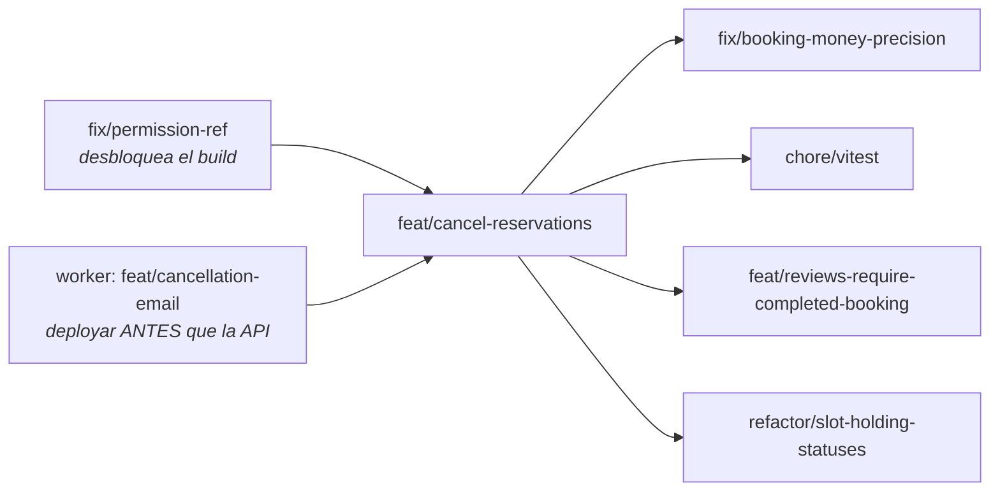

# Cancelación de reservas — split de branches y próximos pasos

> Estado al cerrar la sesión donde se implementó `cancelBooking`.
> Contexto: se reemplazó `deleteBooking` (un `DELETE` duro, sin política real) por un
> `cancelBooking` con reglas de dominio: quién puede cancelar, hasta cuándo, y cuánto
> reembolsa. La lógica pura vive en `lib/bookings/policy.ts`; el service orquesta.
>
> Al hacer ese trabajo aparecieron **otros problemas reales, pero ajenos al feature**.
> Este documento los deja anotados y repartidos en branches, para no arrastrarlos dentro
> de `feat/cancel-reservations`.

---

## El split

| Branch | Qué lleva | Estado |
|--------|-----------|--------|
| ~~`fix/permission-ref`~~ | ~~El `permission.ref` de `app/(app)/profile/page.tsx:113`~~ | ✅ Resuelto |
| `feat/cancel-reservations` | Migración `004`, `lib/bookings/policy.ts`, `cancelBooking`, ownership en accept/reject, enum `BookingStatus` en GraphQL, UI, y el mail de cancelación del lado de la API | ✅ Implementado |
| `feat/cancellation-email` (worker) | Tipo `cancelled`, `refundAmount`/`cancelledBy` y plantilla de mail en `bookings-app-worker` | ✅ Implementado |
| `fix/booking-money-precision` | `005`: `total_price` y `refund_amount` → `NUMERIC(10,2)`; `Booking.total_price: string` pasa a ser verdad | ⬜ Pendiente |
| `chore/vitest` | Infra de tests + specs de `policy.ts` | ⬜ Pendiente |
| `feat/reviews-require-completed-booking` | Trae `isCompleted` y lo cablea en `createReview` | ⬜ Pendiente |
| `refactor/slot-holding-statuses` | Trae `SLOT_HOLDING_STATUSES`, cierra la deuda de `findBookedListingIds` | ⬜ Pendiente |



`fix/permission-ref` va **antes** porque hoy pone en rojo el build de cualquier branch. El worker
también va antes, pero por otro motivo: indexa su copy y sus subjects por `NotificationType`, así
que si la API manda `"cancelled"` y el worker no lo conoce, el job explota y BullMQ lo reintenta
para siempre. Los demás dependen de que `feat/cancel-reservations` mergee.

---

## ~~`fix/permission-ref`~~ — ✅ resuelto

> **Resolución:** el historial (`f796096`) muestra que el campo `ref` se eliminó a propósito
> (se borró del tipo y de todos los valores en el mismo commit; varios eran placeholders `RF-XX`).
> Se tomó la primera salida: se borró el `<span>` huérfano de `profile/page.tsx` y el JSDoc
> huérfano de `lib/permissions.ts`. Build verde.

`app/(app)/profile/page.tsx:113` lee `permission.ref`, un campo que **no existe** en el tipo
`Permission` (`lib/permissions.ts`). Quedó el JSDoc huérfano en `lib/permissions.ts:13`
describiendo un campo que ya no está: *"Requirement this permission traces back to, e.g. RF-08"*.

```
app/(app)/profile/page.tsx(113,39): error TS2339: Property 'ref' does not exist on type 'Permission'.
```

Es un one-liner y **no tiene nada que ver con bookings**, pero hoy pone en rojo el `pnpm build`
de cualquier branch. Por eso va solo y va primero: así el PR de cancelación se rebasa y queda verde
por mérito propio.

Dos salidas posibles — decidir cuál refleja la intención original:

- Borrar el `<span>` que lo renderiza (si el campo se eliminó a propósito).
- Devolver `ref?: string` al tipo `Permission` y poblarlo (si la trazabilidad a los RF se quiere de vuelta).

---

## `fix/booking-money-precision` — dinero en punto flotante 💰

**Dos bugs entrelazados, ambos preexistentes:**

**1. `total_price REAL` es punto flotante para dinero.** `REAL` es `float4`: ~7 dígitos
significativos. `12345.67` ya está en el límite; de ahí para arriba pierde precisión.
El propio spec (`docs/PROYECTO_B_MARKETPLACE.md:98`) dice **`numeric total_price`** — la intención
estaba, la migración `001` no la siguió.

**2. El tipo miente.** `lib/types/booking.ts` declara `total_price: string`, pero node-postgres
parsea `float4` con `parseFloat` y devuelve **`number`**. Funciona de casualidad porque todos los
call sites hacen `Number(...)` o `parseFloat(...)`, que sobre un `number` son no-ops. Pero
`booking.total_price.slice(0, 2)` **typechequea y explota en runtime**.

**Por qué se arregla solo y no dentro de `004`:** se evaluó meterlo en la migración de cancelación
con el argumento de que "había ventana antes de que `004` corriera". **Ese argumento era falso.**
`total_price` es `REAL` desde `001`, así que convertirlo siempre iba a requerir su propia migración
con conversión de datos, exista `004` o no. Lo único que se ahorraba era convertir `refund_amount`,
una columna nueva y vacía — marginal, y no justifica meter un cambio de tipo de dinero en un branch
de cancelación.

Por eso `004` deja **`refund_amount REAL`** a propósito: queda consistente con `total_price` dentro
de la tabla, y una sola `005` convierte las dos columnas juntas.

> **Nota sobre los tipos:** hoy `refund_amount: number` y `total_price: string` conviven en
> `Booking`, lo cual se ve inconsistente. No lo es: `number` es lo que pg **realmente** devuelve
> para `REAL`. El que miente es `total_price`. Al pasar ambas columnas a `NUMERIC` — que pg sí
> devuelve como **string** — las dos quedan `string` y el tipo pasa a ser verdad.

**Alcance:** migración `005` con `ALTER COLUMN ... TYPE NUMERIC(10,2)` para las dos columnas,
`Booking.refund_amount: string`, y revisar los call sites (`lib/apollo/resolvers.ts:55`,
`lib/events.ts:166`, `lib/bookings/policy.ts` → `toCancellableBooking`).

---

## `chore/vitest` — no hay infra de tests

El proyecto **no tiene ninguna**: ni `vitest` ni `jest` en `devDependencies`, ni script `test`.

`lib/bookings/policy.ts` se diseñó puro (sin DB, sin React, sin framework) explícitamente para ser
testeable sin levantar nada — y se entregó sin un solo test. Es el mejor primer candidato que va a
haber: funciones puras, sin mocks, con `Date` fijas y objetos literales.

Casos que valen la pena:

- La ventana de 48h de `refundFor`: justo antes, justo después, y el borde exacto.
- `canCancel` con `hasStarted` en el límite (`now === start_date`).
- Host cancelando una `accepted` → reembolso total, sin importar la proximidad al check-in.
- Guest cancelando una `pending` → reembolso total aunque falten 2 horas.
- Estados terminales (`rejected` / `cancelled`) → siempre rechaza.
- Host sobre una `pending` → rechaza y sugiere `rejectBooking`.

---

## `feat/reviews-require-completed-booking` — una regla que se promete y no se cumple

`createReview` (`lib/services/reviews.ts:30`) devuelve *"You need a completed booking for this
listing to leave a review"*, pero solo llama a `hasGuestBookingForListing`, que chequea que
**exista** una reserva — sin mirar status ni fechas. O sea: alguien puede reservar y reseñar
en el mismo minuto, o reseñar una reserva rechazada.

Se decidió que `completed` es **derivado, no almacenado**: una reserva está completada si es
`accepted` y su `end_date` ya pasó. Almacenarlo obligaría a un job programado que flipee la fila
cuando la fecha rueda, y esos dos campos ya lo dicen.

La función que lo define ya está escrita y probada en diseño, pero **no viaja en
`feat/cancel-reservations`** porque ahí no la consume nadie. Llega con este branch, junto a su
consumidor:

```ts
export function isCompleted(booking: CancellableBooking, now: Date): boolean {
  return (
    booking.status === "accepted" &&
    new Date(booking.endDate).getTime() < now.getTime()
  );
}
```

**Alcance:** agregar `isCompleted` a `lib/bookings/policy.ts`; en el repo, una query genérica
(`findBookingsByGuestAndListing`) que devuelva las filas; y que el **service** filtre con
`isCompleted`. Ojo con la regla de `CLAUDE.md`: decidir *qué cuenta como completada* es lógica de
negocio y **no va en el repo** — el repo devuelve filas, el service decide.

---

## `refactor/slot-holding-statuses` — la deuda que `CLAUDE.md` marca como "no tocar sin pedirlo"

`findBookedListingIds` (`lib/repositories/bookings.pg.ts`) hardcodea en el `WHERE` los estados que
liberan un slot:

```sql
WHERE status NOT IN ('cancelled', 'rejected')
```

Ese conjunto es una **regla de negocio** (qué estados invalidan disponibilidad) filtrada dentro de
un repo. `CLAUDE.md` ya lo documenta como deuda conocida.

Hoy esa regla está escrita en **tres lugares**: el `WHERE` del repo, el predicado del constraint
`no_overlap` (`db/migrations/003_booking_no_overlap.sql`), y la definición de dominio. La constante
que la unificaría del lado de la app ya está diseñada, pero **no viaja en
`feat/cancel-reservations`** — sin consumidor sería una cuarta copia que puede desincronizarse:

```ts
export const SLOT_HOLDING_STATUSES: BookingStatus[] = ["pending", "accepted"];
```

**Alcance:** definirla en `lib/bookings/policy.ts` y pasarla como parámetro desde el service a
`findBookedListingIds`. La copia del constraint SQL **se queda** — es un invariante de la base y
tiene que vivir ahí; lo que corresponde es un comentario cruzado entre ambos.

---

## Mail de cancelación — hecho, con dos cabos sueltos

El tipo `cancelled` ya existe en `lib/events.ts` y en el worker, con `refundAmount` y `cancelledBy`
en el payload y plantilla propia. Lo que queda:

- **El mail siempre va al guest.** `BookingEmailPayload` tiene `guest: { email }` hardcodeado en el
  contrato. Cuando el guest cancela, el host solo se entera por la notificación in-app, no por mail.
  Mandarle mail al host requiere cambiar el payload en ambos repos.
- **La copy in-app de `notify_booking_update` es guest-oriented y está mal para todos.** El título
  es literalmente `"Booking confirmed"` (`src/lib.ts` del worker), y se usa para approved, rejected
  **y** cancelled — o sea que un rechazo llega titulado "Booking confirmed". Ahora además le llega
  al host cuando el guest cancela. No se arregló acá porque el título carga los keywords de los que
  el web app deriva el ícono (`notificationVisual` en `notifications-list.tsx`): cambiarlo cambia el
  ícono. Necesita un tipo in-app propio por evento, coordinado entre los dos repos.

---

## Cabos sueltos menores

- **La disputa no existe.** `canCancel` le dice al guest *"Contact support to open a dispute"*
  cuando la estadía ya empezó, pero no hay support ni flujo de disputa. El permiso
  `admin:manage-disputes` está en el catálogo (`lib/permissions.ts`) y no lo implementa nadie.
  Por ahora es copy que apunta a la nada.
- **`bookings:cancel-own` no gatea al host.** En `cancelBooking` se usa como permiso baseline, pero
  como todo usuario es guest (RF-02), lo tiene todo el mundo: solo prueba que hay sesión. Lo que
  realmente autoriza es el ownership que resuelve `resolveCancelActor`. Funciona, pero si el
  catálogo de permisos crece, un `bookings:cancel-hosted` explícito para el host sería más honesto.
- **`004` ya está aplicada en local** (ver la sección del ledger arriba). Verificado contra la base:
  los 3 CHECK presentes, `status` en `NOT NULL`, y las 3 columnas nuevas con la nullability
  esperada. Los `UPDATE` de normalización no matchearon nada — no había estados legacy ni `NULL`.
  Falta aplicarla en cualquier otro entorno que exista.
