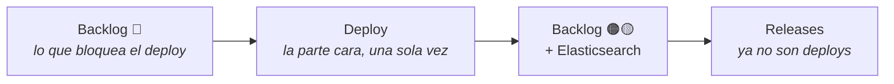
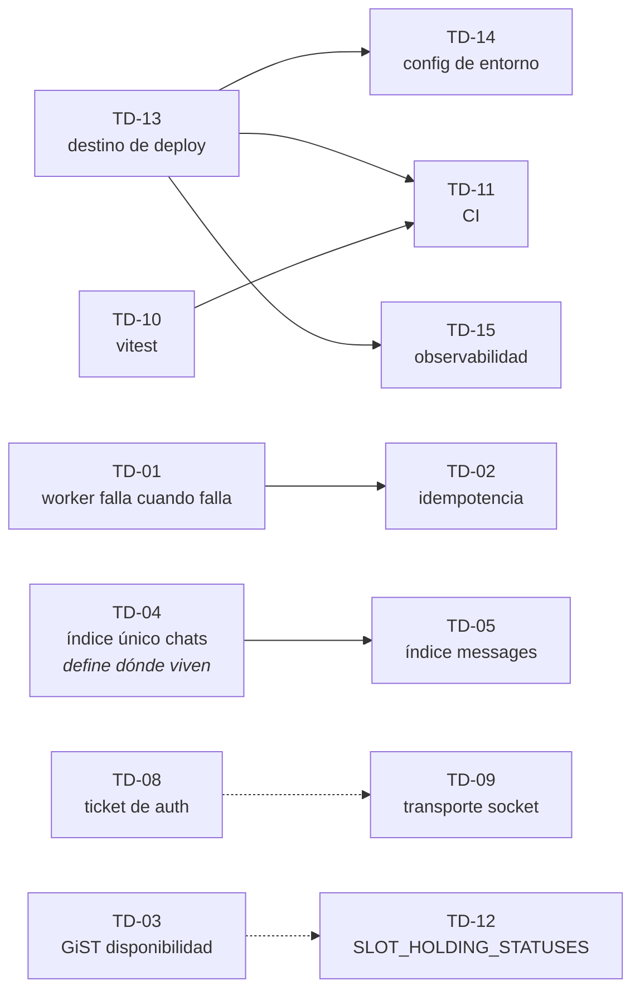

# Tickets — backlog priorizado de deuda técnica

Un ticket = una tarea = un branch. Cada archivo `TD-XX-*.md` describe **qué hacer y cómo saber
que terminó**. El **por qué es deuda** vive en `docs/tech_debt/` y se enlaza, no se copia.

---

## El objetivo

Este proyecto es de **aprendizaje de arquitectura de software**, y su destino es un **portfolio
público**. De ahí salen dos condiciones que mandan sobre todo lo demás:

1. **Se despliega y opera correctamente** en un ambiente accesible por una URL pública y segura.
2. **Todo lo que está construido se puede defender** ante alguien que lo mire con criterio.

No es un producto para un cliente ni va a manejar millones de usuarios. El negocio tiene huecos a
propósito. Pero de las tecnologías que sí están, hay que **sacar lo mejor para la escala actual** —
sin montar infraestructura que a este tamaño es decorativa.

> **El esfuerzo no es criterio de triage.** No hay cliente ni deadline. Que algo lleve 30 minutos o
> 6 horas no decide si entra: decide en qué orden lo hacés dentro de su prioridad.

---

## El criterio de triage

Tres preguntas, en orden. La primera que dé "sí" fija la prioridad:

| | Pregunta | Prioridad | Qué atrapa |
|---|---|---|---|
| 1 | **¿Bloquea un deploy honesto?** | 🔴 Alta | Pérdida silenciosa de datos, Redis creciendo sin techo, algo que funciona en `localhost` y se rompe en producción, superficie de abuso abierta |
| 2 | **¿La tecnología está de adorno?** | 🟠 Media | Una cola que no reintenta es un `setTimeout` caro. Un índice que existe y la query no aprovecha. Redis usado como un almacén de claves y nada más |
| 3 | **¿Es defendible ante alguien que lo mire?** | 🟡 Baja | Código que funciona y despliega, pero que no sabrías justificar. Decisiones sin ADR, inconsistencias del design system, accesibilidad ausente |

**Si no pasa por ninguna, es pulido de producto y no entra.** Que esté bien identificado no alcanza:
features que no van a llegar a producción no justifican el tiempo.

### Los ejes de calidad, y qué se hace con cada uno

Las dimensiones que hacen a un sistema fiable **no se tratan todas igual a esta escala**. Confundirlas
es la principal fuente de sobreingeniería:

| Eje | A esta escala… | Tratamiento |
|---|---|---|
| **Fault tolerance** | Se demuestra igual que a gran escala | **Se construye.** Reintentos, idempotencia, reconexión, degradación |
| **Performance** | Los números no impresionan — hay pocos datos | **Se mide.** Lo que vale es el método: `EXPLAIN ANALYZE` / `explain()` antes y después. El *cómo lo supiste*, no el ms |
| **Escalabilidad** | No se puede demostrar sin teatro | **Se documenta.** Réplicas de lectura para doce filas delata que no entendés cuándo hacen falta |
| **Frontend architecture** | Se ve entera con abrir el repo | **Se construye.** Límites de streaming, boundaries de error, partición de componentes |
| **Design system** | Ídem, y aplica también al backend | **Se construye.** Consistencia de primitivos, tokens, contratos entre capas |
| **Seguridad** | Superficie chica pero pública | **Se construye lo angosto** (cotas de abuso, secretos, red privada); el resto se documenta |

### La regla de la escalabilidad

Todo ticket cierra con **"Si esto escalara"**: hasta dónde aguanta lo que hiciste, y cuál sería el
próximo movimiento si el sistema creciera de un día para el otro.

No es relleno — es la parte que convierte el backlog en evidencia de criterio arquitectónico.
Muestra que conocés el techo de tu propia decisión, que es lo que separa a alguien que entendió el
problema de alguien que copió una solución.

---

## El plan



**El deploy caro es el primero**: topología, red privada, secretos, servicios administrados. Una vez
que eso existe, todo lo que sigue es un merge. Por eso conviene pagarlo temprano y no al final.

**Elasticsearch quedó después del deploy** (decisión tomada, ver `Descartado y por qué`). Efecto
lateral bueno: al llegar sobre un sistema andando, la mejora de búsqueda se puede **medir contra una
base real** en vez de nacer con ella.

---

## Backlog

### Pre-deploy — la puerta

Todo lo que responde 🔴 a la primera pregunta. Es la lista completa de lo que hay que cerrar antes de
exponer el sistema.

| Ticket | Título | Bloque | Por qué bloquea |
|--------|--------|--------|-----------------|
| [TD-01](TD-01-bullmq-delivery-reliability.md) | Que el worker falle cuando falla | Cola | Mails perdidos en silencio; Redis sin techo |
| [TD-02](TD-02-bullmq-idempotency.md) | Idempotencia por `jobId` | Cola | TD-01 activa reintentos → sin esto se duplican mails **en producción** |
| [TD-04](TD-04-chats-unique-index.md) | Índice único `chats.booking_id` | Índices | Duplicación real de datos, no performance |
| [TD-05](TD-05-messages-chat-id-index.md) | Índice y cota en `messages` | Índices | `COLLSCAN` sobre *todos* los mensajes + devuelve el hilo entero sin límite |
| [TD-08](TD-08-chat-auth-ticket.md) | Ticket firmado para autorizar el room | Chat | `sameSite: "strict"` rompe el chat apenas el worker vive en otro dominio |
| [TD-09](TD-09-socket-transport-robustness.md) | Robustez del transporte socket | Chat | En redes reales el socket se cae constantemente; hoy el chat muere en silencio |
| [TD-10](TD-10-vitest.md) | Infra de tests + specs de `policy.ts` | Calidad | Habilita TD-11 y cualquier cambio posterior sin miedo |
| [TD-11](TD-11-ci-pipeline.md) | Pipeline de CI | Calidad | Un ambiente vivo sin verificación previa es cómo se rompe producción |
| [TD-13](TD-13-deploy-target.md) | Destino de deploy + contenedores | Deploy | *Es* el deploy — topología, servicios administrados, red privada, TLS |
| [TD-14](TD-14-env-config.md) | Config de entorno unificada y validada | Deploy | Dos esquemas de Redis; secretos sin auditar; nada valida el env al boot |
| [TD-15](TD-15-observability.md) | Health checks + visibilidad de la cola | Observabilidad | Sin esto, la fault tolerance de TD-01/02 es una afirmación sin evidencia |
| [TD-16](TD-16-error-loading-boundaries.md) | Error y loading boundaries | Frontend | 13 rutas, cero boundaries: un `throw` en producción es la pantalla gris de Next |
| [TD-20](TD-20-rate-limiting.md) | Rate limiting con Redis en el borde público | Seguridad | Fuerza bruta en login y quema de la cuota de Resend vía signup |
| [TD-21](TD-21-graphql-limits.md) | Cotas del endpoint GraphQL | Seguridad | `limit` sin techo desde el cliente + amplificación por alias, sobre queries sin índice |

### Post-deploy

Se despachan contra un sistema ya andando, como releases.

| Ticket | Título | Bloque | Prioridad |
|--------|--------|--------|-----------|
| **Fase 4** | Elasticsearch + cola de sincronización Mongo → ES | Búsqueda | 🟠 |
| [TD-03](TD-03-bookings-daterange-gist.md) | Índice GiST parcial para disponibilidad | Índices | 🟠 |
| [TD-06](TD-06-conversations-batch-query.md) | N+1 en el rail de mensajería | Queries | 🟠 |
| [TD-07](TD-07-messages-rail-suspense.md) | Suspense en el rail de `/messages` | Queries | 🟡 |
| [TD-12](TD-12-slot-holding-statuses.md) | `SLOT_HOLDING_STATUSES` fuera del repo | Higiene | 🟡 |
| [TD-17](TD-17-accessibility-baseline.md) | Baseline de accesibilidad | Frontend | 🟡 |
| [TD-18](TD-18-component-partition.md) | Partición de componentes pendiente | Frontend | 🟡 |
| [TD-19](TD-19-design-system-audit.md) | Auditoría del design system | Frontend | 🟡 |
| [TD-22](TD-22-architecture-adrs.md) | ADRs y diagramas de arquitectura pendientes | Documentación | 🟡 |
| [TD-23](TD-23-mongo-search-indexes.md) | Índices provisorios en Mongo para la búsqueda | Queries | 🟡 |

> **Todos los tickets están escritos.** Los 14 de pre-deploy y los 9 de post-deploy (TD-03 a TD-23 +
> Fase 4).
>
> **TD-18 y TD-19 ya pasaron el scoping** sobre `components/`: la partición se concentra en
> `filters.tsx` (496 líneas) y el design system está mejor de lo que `CLAUDE.md` admite (tokens
> completos, 4 colores hardcodeados) — TD-19 quedó como auditoría de cierre, no reescritura.
>
> **TD-23 es condicional.** Bajo el plan actual (ES es lo primero post-deploy) **no se ejecuta**:
> dejar el `COLLSCAN` sin tocar da la medición base limpia para el antes/después de ES. Solo se
> dispara si ES se posterga. Ver el ticket.

### Dependencias reales



Las líneas llenas son bloqueos reales. Las punteadas son afinidad: tocan lo mismo y conviene hacerlas
seguidas, pero ninguna espera a la otra.

`TD-16`, `TD-20` y `TD-21` no dependen de nada y se pueden tomar en cualquier momento.

---

## Orden sugerido

1. **TD-01 → TD-02** — la cola pasa de decorativa a real. Mejor relación aprendizaje/trabajo de todo
   el backlog, y TD-02 va pegado porque activar reintentos sin idempotencia cambia "pierdo mails" por
   "mando mails de más".
2. **TD-10 → TD-11** — a partir de acá los cambios se verifican solos, y todo lo que sigue es más
   barato.
3. **TD-04 → TD-05** — los índices de la feature más nueva. Se miden con `explain()` antes y después.
4. **TD-08 → TD-09** — el único trabajo de arquitectura de verdad del backlog, y el transporte que lo
   acompaña. Juntos porque TD-08 cambia cómo viaja la credencial y TD-09 cambia cuándo se re-evalúa.
5. **TD-16** — el frontend deja de tener un agujero visible en producción.
6. **TD-13 → TD-14 → TD-15** — la infraestructura, al final y de una vez. TD-13 decide la topología;
   los otros dos la hacen operable.
7. **TD-20 → TD-21** — las cotas del borde, justo antes de abrir la puerta.

Después: deploy, y el resto pasa a ser release.

---

## Formato de un ticket

```markdown
# TD-XX — Título

| | |
|---|---|
| **Branch** | `tipo/nombre` |
| **Bloque** | Cola / Índices / Queries / Chat / Calidad / Higiene / Deploy / Observabilidad / Frontend / Seguridad / Documentación |
| **Prioridad** | 🔴 Alta / 🟠 Media / 🟡 Baja |
| **Momento** | Pre-deploy / Post-deploy |
| **Depende de** | TD-XX o — |
| **Origen** | doc de `tech_debt/` que lo describe |
| **Repos** | `bookings_app` y/o `bookings-app-worker` |

## Problema          → qué está mal hoy, verificado contra el código
## Por qué entra     → contra cuál de las tres preguntas pasa
## Alcance           → los archivos y el cambio concreto
## Criterio de aceptación → cómo se sabe que terminó (medible)
## Si esto escalara  → hasta dónde aguanta, y cuál sería el próximo movimiento
## Fuera de alcance  → lo que NO se toca, para que el branch no crezca
```

---

## Descartado y por qué

Lo que se evaluó y **no** entra. Esta sección no se borra: la lista de lo que decidiste no hacer, con
el motivo, es tanta evidencia de criterio como el backlog mismo.

| Descartado | Motivo |
|---|---|
| **Kubernetes, load balancer, múltiples instancias, autoscaling** | Una sola instancia sin tráfico. Construirlo no demuestra que sabés — demuestra que no sabés cuándo hace falta. Va a "Si esto escalara" |
| **Prometheus + Grafana + OpenTelemetry** (Fase 6 del plan original) | Un stack de observabilidad más grande que la aplicación que observa. La versión honesta a esta escala es TD-15: health checks, logs estructurados y Bull Board |
| **WAF, protección de DDoS, pentesting** | El riesgo real de un deploy de portfolio no es que lo tiren: es fuerza bruta en auth y quema de cuota de Resend. Eso lo cubre TD-20 |
| **Secret manager dedicado** (Vault y similares) | Las variables de entorno del PaaS alcanzan y sobran a esta escala |
| **Elasticsearch antes del deploy** | Es la pieza cara de hostear (2 GB+ de heap, sin free tier comparable al de PG/Mongo/Redis) y hubiera dominado la decisión de topología por una feature todavía sin escribir. Va después, sobre un sistema medible |
| **Cobertura de tests como métrica** | No aporta nada a esta escala. Lo que importa es que los bordes de `policy.ts` estén cubiertos, no el porcentaje |
| **Índices compuestos sobre `attributes.*` en Mongo** | Los tira Elasticsearch. Ver TD-23 para la versión acotada que sí puede entrar si ES se demora |
