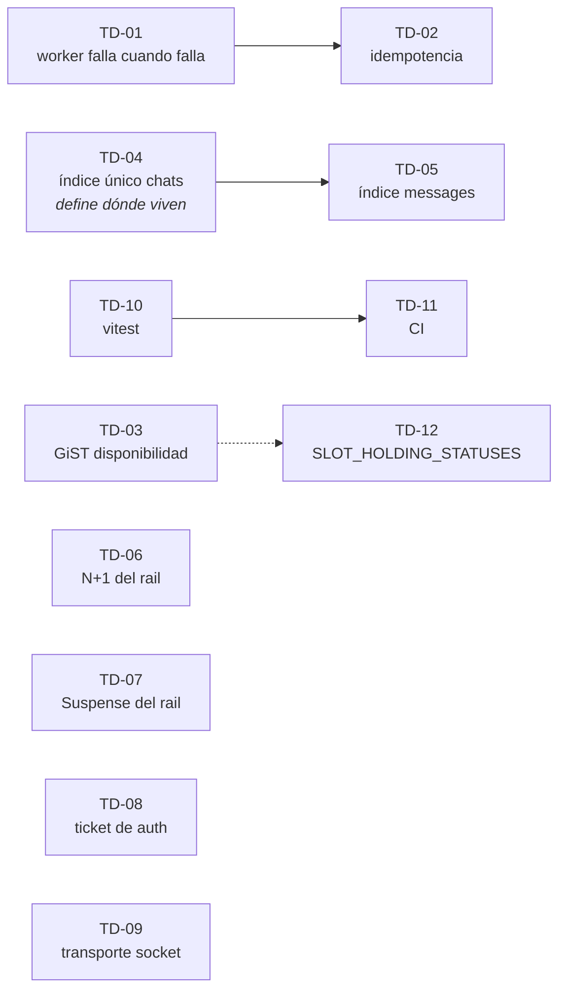

# Tickets — backlog priorizado de deuda técnica

Un ticket = una tarea = un branch. Cada archivo `TD-XX-*.md` describe **qué hacer y cómo saber
que terminó**. El **por qué es deuda** vive en `docs/tech_debt/` y se enlaza, no se copia.

---

## El criterio de triage

Este proyecto es de **aprendizaje**: el objetivo es sacarle el jugo a cada tecnología del stack,
no llevar un marketplace real a producción. El negocio tiene huecos a propósito. Pero lo que sí
se construye tiene que ser **sólido y desplegable**.

De ahí salen las dos únicas preguntas que deciden si un ítem de deuda entra al backlog:

1. **¿Me enseña algo de la tecnología?** — un índice GiST que hay que entender para que sirva,
   la semántica *at-least-once* de una cola, la reconexión de un socket.
2. **¿Bloquea un deploy honesto?** — pérdida silenciosa de mensajes, Redis creciendo sin techo,
   cero verificación automatizada.

**Si no es ninguna de las dos, es pulido de producto y no entra.** Que esté bien identificado no
alcanza: features que no van a llegar a producción no justifican el tiempo.

---

## Backlog

| Ticket | Título | Bloque | Prioridad | Esfuerzo |
|--------|--------|--------|-----------|----------|
| [TD-01](TD-01-bullmq-delivery-reliability.md) | Que el worker falle cuando falla | Cola | 🔴 Alta | ~30 min |
| [TD-02](TD-02-bullmq-idempotency.md) | Idempotencia por `jobId` | Cola | 🟠 Media | ~1 h |
| [TD-03](TD-03-bookings-daterange-gist.md) | Índice GiST parcial para disponibilidad | Índices | 🔴 Alta | ~1 h |
| [TD-04](TD-04-chats-unique-index.md) | Índice único `chats.booking_id` | Índices | 🔴 Alta | ~1-2 h |
| [TD-05](TD-05-messages-chat-id-index.md) | Índice y cota en `messages` | Índices | 🔴 Alta | ~1 h |
| [TD-06](TD-06-conversations-batch-query.md) | N+1 en el rail de mensajería | Queries | 🟠 Media | ~1 h |
| [TD-07](TD-07-messages-rail-suspense.md) | Suspense en el rail de `/messages` | Queries | 🟡 Baja | ~30 min |
| [TD-08](TD-08-chat-auth-ticket.md) | Ticket firmado para autorizar el room | Chat | 🔴 Alta | ~4-6 h |
| [TD-09](TD-09-socket-transport-robustness.md) | Robustez del transporte socket | Chat | 🟠 Media | ~2-3 h |
| [TD-10](TD-10-vitest.md) | Infra de tests + specs de `policy.ts` | Calidad | 🔴 Alta | ~2-3 h |
| [TD-11](TD-11-ci-pipeline.md) | Pipeline de CI | Calidad | 🟠 Media | ~1-2 h |
| [TD-12](TD-12-slot-holding-statuses.md) | `SLOT_HOLDING_STATUSES` fuera del repo | Higiene | 🟡 Baja | ~30 min |

### Dependencias



Las líneas llenas son dependencias reales: TD-02 no tiene sentido sin los reintentos que habilita
TD-01, y TD-05 usa el mecanismo de índices que establece TD-04. La punteada es afinidad, no
bloqueo: TD-03 y TD-12 tocan la misma query, conviene hacerlos seguidos.

Los cuatro sueltos no dependen de nada y se pueden tomar en cualquier orden.

---

## Orden sugerido

1. **TD-01 → TD-02** — media hora convierte la cola de decorativa en real. Mejor relación
   aprendizaje/esfuerzo de todo el backlog.
2. **TD-04 → TD-05 → TD-03** — los tres índices juntos. Se miden con `explain()` / `EXPLAIN ANALYZE`
   antes y después, así que conviene hacerlos en bloque mientras tenés el método fresco.
3. **TD-10 → TD-11** — a partir de acá los cambios se pueden verificar solos.
4. **TD-08** — el único trabajo de arquitectura de verdad que queda en el backlog.
5. El resto por gusto.

---

## Formato de un ticket

```markdown
# TD-XX — Título

| | |
|---|---|
| **Branch** | `tipo/nombre` |
| **Bloque** | Cola / Índices / Queries / Chat / Calidad / Higiene |
| **Prioridad** | 🔴 Alta / 🟠 Media / 🟡 Baja |
| **Esfuerzo** | estimación |
| **Depende de** | TD-XX o — |
| **Origen** | doc de `tech_debt/` que lo describe |

## Problema          → qué está mal hoy, verificado contra el código
## Por qué entra     → contra cuál de los dos criterios pasa
## Alcance           → los archivos y el cambio concreto
## Criterio de aceptación → cómo se sabe que terminó (medible)
## Fuera de alcance  → lo que NO se toca, para que el branch no crezca
```
