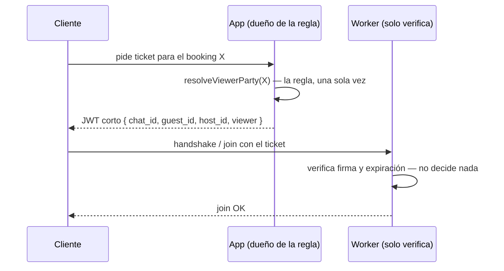

# TD-08 — Ticket firmado para autorizar el room

| | |
|---|---|
| **Branch** | `refactor/chat-auth-ticket` |
| **Bloque** | Chat |
| **Prioridad** | 🔴 Alta |
| **Esfuerzo** | ~4-6 h |
| **Depende de** | — |
| **Origen** | [`tech_debt/CHAT_FEATURE_NEXT_STEPS.md`](../tech_debt/CHAT_FEATURE_NEXT_STEPS.md) § La regla de autorización está implementada dos veces |
| **Repos** | `bookings_app` + `bookings-app-worker` |

## Problema

La misma regla de negocio —*¿este usuario es parte de este booking?*— está implementada dos veces,
en dos repos que se deployan por separado:

| | App | Worker |
|---|---|---|
| **Dónde** | `lib/services/chat.ts` → `resolveViewerParty` | `src/chat/parties.ts` → `findChatParties` + `isParty` |
| **Cómo** | booking en PG → si no es el guest, listing en Mongo → comparar `host_id` | idéntico |
| **Quién la usa** | `getChatHistory` (HTTP) | `authorizeRoom` (join) y `registerMessageFlow` (envío) |

Dos implementaciones, misma pregunta. El día que cambie quién puede leer un hilo —por ejemplo,
bloquear reservas canceladas— se toca un repo y el otro sigue respondiendo lo viejo. **La
divergencia es silenciosa:** el HTTP niega y el socket permite, o al revés.

Hay un segundo problema encima, que hoy no se ve: la cookie de sesión se firma con
`sameSite: "strict"` (`lib/services/auth.ts:54,92`). El handshake funciona en dev porque
`localhost:3000` y `:4000` son *same-site* — el puerto no cuenta para esa regla. **Se rompe apenas
el worker viva en otro dominio**, que es exactamente lo que pasa al deployar.

## Por qué entra

Pasa por los **dos** criterios, y es el único trabajo de arquitectura de verdad que queda.

- **Aprendizaje:** es la distinción que el propio doc formula bien y que vale la pena tener hecha
  con las manos: **los datos se replican entre servicios; las conclusiones se delegan a un solo
  dueño.** Replicar a mano los tipos de los payloads de BullMQ está bien y ya se hace. Replicar a
  mano una *decisión* no. Entender por qué esas dos cosas se ven iguales en el diff y son
  completamente distintas es la lección.
- **Deploy:** `sameSite: "strict"` es un bloqueante real de deploy multi-dominio, y este ticket lo
  destraba de paso. Dos problemas, un cambio.

## Alcance

**Opción elegida: el token transporta la autorización** (opción 1 de las tres del doc).

Es la más liviana y la única que no agrega latencia ni acopla el worker a la disponibilidad del
app. El "ticket" se había descartado al elegir cookie forwarding; acá vuelve a tener sentido porque
ahora el problema no es *autenticar* sino *autorizar un recurso puntual*.

### Cómo queda el flujo

### Piezas

**App:**
- Emitir un JWT de vida corta, firmado con el secreto ya compartido, con las claims mínimas:
  `chat_id`, `guest_id`, `host_id`, `viewer` (qué parte es quien pide). Reusa `resolveViewerParty`,
  que ya existe y ya es el dueño de la regla.
- Un punto de entrada para pedirlo (Server Action o route handler), llamado antes de conectar.

**Worker:**
- `authorizeRoom` pasa a **solo verificar la firma** y que el `chat_id` del ticket coincida con el
  room pedido. Sin PG, sin Mongo, sin regla.
- **Ojo con `registerMessageFlow`:** hoy usa `findChatParties` para dos cosas distintas —autorizar
  al emisor **y** obtener `guest_id`/`host_id` para el documento de chat del upsert. Meter las dos
  party ids en las claims cubre los dos usos y deja al worker sin necesidad de tocar ninguna base
  para el flujo de chat. Ese es el resultado que buscamos, no un efecto lateral.
- El chequeo del emisor en `registerMessageFlow` **se mantiene**: un socket puede emitir a un room
  al que nunca hizo join. Lo que cambia es de dónde sale la verdad, no que se chequee.

### Tradeoff a dejar anotado

Las party ids del ticket son un **snapshot** del momento en que se emitió. Un TTL corto (minutos)
acota la ventana de staleness. Vale la pena escribir en el ADR por qué eso es aceptable acá — es
la contracara honesta de delegar la decisión.

## Criterio de aceptación

- [ ] `authorizeRoom` no importa nada de `pg/` ni de `mongo/`.
- [ ] `findChatParties` deja de existir en el worker, o queda sin usarse en el flujo de chat.
- [ ] Un ticket vencido o firmado para otro `chat_id` es rechazado en el join.
- [ ] El chat sigue funcionando end-to-end con dos cuentas (ver el procedimiento en
      `CHAT_FEATURE_NEXT_STEPS.md`).
- [ ] `docs/architecture/REAL_TIME_TRANSPORT_AND_FAN_OUT.md` refleja la decisión y por qué el
      ticket —descartado en su momento— vuelve.

## Fuera de alcance

- **Cambiar `sameSite`** de la cookie de sesión. Este ticket **destraba** el deploy multi-dominio
  porque el ticket viaja por `auth`, no por cookie — pero tocar la cookie de sesión es otro riesgo
  y otro branch.
- Si el ticket termina viajando por `auth` de socket.io, tiene que ser **función**, no objeto
  literal: `auth: (cb) => cb({ ticket })`. Un objeto congela el valor en la primera conexión y al
  vencer todas las reconexiones fallan en silencio. Está anotado en `CHAT_FEATURE_NEXT_STEPS.md`
  § Robustez del transporte, y se cruza con TD-09 — coordinar si se hacen juntos.
- Las otras dos opciones del doc (endpoint interno, proyección en Redis).
