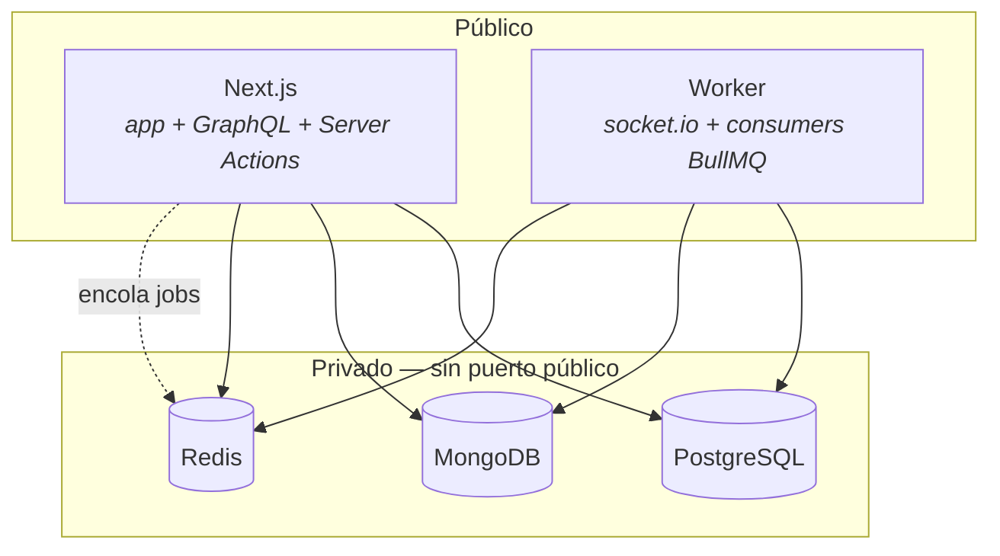

# TD-13 — Destino de deploy + contenedores

| | |
|---|---|
| **Branch** | `chore/deploy-target` |
| **Bloque** | Deploy |
| **Prioridad** | 🔴 Alta |
| **Momento** | Pre-deploy |
| **Depende de** | — (habilita TD-11, TD-14, TD-15) |
| **Origen** | Re-triage del backlog contra el objetivo de portfolio |
| **Repos** | `bookings_app` + `bookings-app-worker` |

## Problema

No hay destino de deploy definido ni forma de empaquetar la aplicación. Verificado:

- **`bookings_app` no tiene `Dockerfile` ni `docker-compose.yml`.**
- El worker tiene `docker-compose.yml`, pero solo levanta infraestructura local — no se empaqueta a sí mismo.
- No hay `.github/workflows/` en ninguno de los dos repos.

Y la topología **no es trivial**, que es lo que hace que esto sea una decisión de arquitectura y no
un trámite:

## Por qué entra

**Pregunta 1.** Es el deploy: sin esto no hay URL pública y el objetivo del proyecto no se cumple.

Pero además tiene contenido real de arquitectura, y es el motivo por el que este ticket no es
devops de trámite:

> **El worker no puede vivir en un runtime serverless.** `socket.io` sostiene conexiones abiertas y
> los consumers de BullMQ son loops de vida larga; una función que se muere entre requests no puede
> hacer ninguna de las dos cosas. Esa restricción es la que **justifica el split app/worker que ya
> existe** — el deploy la vuelve visible en vez de teórica.

## Alcance

### 1. Decidir el host de cada pieza

| Pieza | Requisito | Nota |
|---|---|---|
| `bookings_app` | Runtime de Next.js | Serverless sirve |
| `bookings-app-worker` | **Proceso persistente** | Serverless **no** sirve |
| PostgreSQL / MongoDB / Redis | Administrados, red privada | Los tres tienen free tier |

**Bases administradas, las tres.** La justificación es explícita y va escrita: el aprendizaje que
persigue este proyecto está en la aplicación, no en operar un `pgbouncer`. Y resuelve de arranque
red privada, TLS y backups.

### 2. Empaquetado

`Dockerfile` para el worker. La base ya es buena: tiene `build` y `start` en `package.json`, y
**graceful shutdown de `SIGTERM`/`SIGINT` ya implementado** (`src/index.ts:52-53`) — que es
exactamente lo que un orquestador necesita para no cortar jobs a la mitad. Eso ya está bien y no se
toca.

### 3. Superficie de red

- Ninguna base con puerto público. Las tres solo alcanzables desde app y worker.
- HTTPS en la app, **`wss://`** en el socket (hoy `lib/socket.ts:47` cae a `http://localhost:4000`).
- Un usuario de DB para la aplicación, no el superusuario.

### 4. Diagrama de topología

En `docs/architecture/`: qué corre dónde, qué habla con qué, qué es público y qué es privado.

## Criterio de aceptación

- [ ] La app responde en una URL pública con HTTPS válido.
- [ ] El chat funciona end-to-end entre dos cuentas **sobre `wss://`**, con el worker en otro dominio.
- [ ] Ninguna de las tres bases acepta conexiones desde fuera de la red privada. Verificado
      intentando conectar desde afuera, no asumido.
- [ ] Un redeploy del worker no pierde jobs encolados: se apagan los consumers, Redis retiene, se
      procesan al volver.
- [ ] El diagrama de topología está en `docs/architecture/` y refleja lo desplegado.

## Si esto escalara

Aguanta una instancia de cada cosa, que a esta escala es de sobra.

**El primer techo es el worker**: es un punto único: si se cae, se paran los mails y el chat entero.
El próximo movimiento sería N réplicas — y lo interesante es que **la arquitectura ya está lista para
eso sin cambios**: BullMQ reparte los jobs entre consumers solo, y el adapter de Redis de socket.io
ya está puesto justamente para el fan-out entre instancias. Está en el diseño desde el principio;
falta solamente subir el número.

El segundo techo sería PostgreSQL bajo Next serverless: muchas instancias efímeras abren muchas
conexiones. Ahí entra el pooling (`pgbouncer` o el pooler del proveedor).

## Fuera de alcance

- **CD automático.** Primero que exista el destino; automatizar el push es otro ticket.
- **Kubernetes, load balancer, múltiples instancias, autoscaling.** Ver `Descartado y por qué` en el
  README del backlog.
- **Variables de entorno y secretos** → **TD-14**.
- **Health checks y observabilidad** → **TD-15**.
