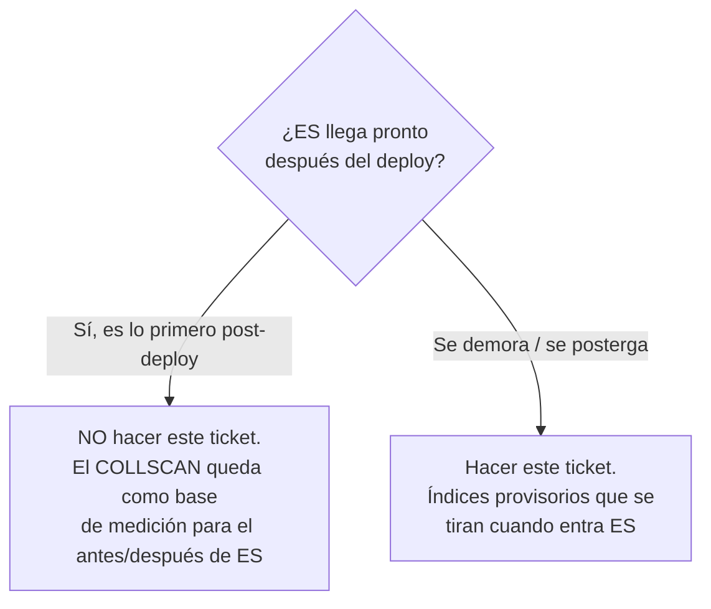

# TD-23 — Índices provisorios en Mongo para la búsqueda

| | |
|---|---|
| **Branch** | `perf/mongo-search-indexes` |
| **Bloque** | Queries |
| **Prioridad** | 🟡 Baja |
| **Momento** | Post-deploy (condicional — ver abajo) |
| **Depende de** | — |
| **Origen** | [`tech_debt/PERFORMANCE.md`](../tech_debt/PERFORMANCE.md) puntos 4 y 5 |
| **Repos** | `bookings_app` |

## Problema

La búsqueda de listings corre **sin índices sobre los campos de filtro.** `PERFORMANCE.md` lo
documenta en los puntos 4 y 5, verificado contra el código:

- **`getListings` filtra sobre muchos campos** (`type`, `host_id`, `rating_avg`, `price`,
  `attributes.property_type`, `beds`, `bathrooms`, `max_guests`, `amenities`) y el único índice que
  existe es el text index sobre `title`/`description` del seed.
- **Una búsqueda sin `term` —solo filtros, el caso más común al abrir el panel— es un `COLLSCAN`
  completo** en cada request.
- **El `$nin` de disponibilidad** (`params._id = { $nin: ... }`) se evalúa documento por documento y
  amplifica el costo.

Esto **no es nuevo** — es deuda ya documentada. Lo que cambió es el plan: Elasticsearch se
despriorizó a después del primer deploy, así que ES ya no lo resuelve antes de exponer el sistema.

## El condicional — por qué este ticket puede no ejecutarse nunca

Este es el único ticket del backlog **deliberadamente condicional**, y la condición importa más que
el fix:

El plan acordado es **deploy → Elasticsearch → releases**, con ES como lo primero después del deploy.
Bajo ese plan, **este ticket no se hace**: dejar el `COLLSCAN` sin tocar da la medición base limpia
para mostrar el impacto de ES (`explain()` antes con scan completo, después con el índice de
búsqueda). Un índice provisorio en el medio ensucia esa comparación y se borraría a las dos semanas.

Este ticket existe como **red**: si ES se posterga y el sistema va a vivir un tiempo con la búsqueda
sin índice frente a usuarios reales, entonces sí hay que poner índices provisorios. No antes.

## Por qué entra (si entra)

**Pregunta 2, condicionada a la 1.** Mongo con un `COLLSCAN` en la query más frecuente es la base de
datos usada por debajo de su capacidad —el índice es *la* herramienta de Mongo— pero solo se vuelve
un problema de deploy honesto si el sistema realmente opera así frente a tráfico real. Mientras ES
sea inminente, la respuesta correcta es esperar, no indexar.

## Alcance (solo si se dispara la condición)

**1. Medir primero.** `db.listings.find(<filtro>).explain("executionStats")` sobre los filtros
reales del panel, sin `term`. Anotar `totalDocsExamined` vs `nReturned` y el `stage: COLLSCAN`. Sin
esta medición base, el "después" no prueba nada.

**2. Índices dirigidos a los filtros más usados**, no a todos. El panel filtra casi siempre por
`type` y `price`; empezar por ahí. Un índice por cada campo de `attributes.*` es justo lo que
`PERFORMANCE.md` advierte no hacer —se tiran con ES— así que el criterio es cubrir los filtros de alta
frecuencia y parar.

**3. Definir el índice en un lugar canónico, no en el seed.** El problema que TD-04 ya señaló: los
índices de Mongo hoy viven sueltos dentro de scripts de seed, así que un ambiente que no sembró datos
no los tiene. Este ticket **no** debe repetir ese patrón — coordina con la decisión de TD-04 sobre
dónde viven los índices de Mongo.

**4. Medir después** con el mismo `explain()` y dejar el antes/después escrito.

## Criterio de aceptación (si se ejecuta)

- [ ] Existe la medición base (`COLLSCAN`, `totalDocsExamined ≫ nReturned`) antes de tocar nada.
- [ ] Los índices cubren los filtros de alta frecuencia (`type`, `price`), no todos los campos.
- [ ] La misma query después usa `IXSCAN`, con `totalDocsExamined` cerca de `nReturned`.
- [ ] Los índices se crean desde un lugar canónico, no desde un script de seed.
- [ ] El antes/después queda documentado en `PERFORMANCE.md`.

## Si esto escalara

Estos índices son un **paliativo con fecha de vencimiento**, no una solución — ese es su rasgo
definitorio. Aguantan hasta que el volumen o la complejidad de la búsqueda (full-text con relevancia,
filtros geo, faceting) supere lo que un índice de Mongo hace bien, que es exactamente la línea donde
Elasticsearch deja de ser opcional.

El movimiento siguiente **ya está decidido y es Fase 4**: ES con la cola de sincronización Mongo → ES.
Cuando eso entre, estos índices se **borran** —la búsqueda se va al índice de ES y Mongo vuelve a ser
solo la fuente de verdad de los documentos. Que el fix esté diseñado para tirarse es correcto, no un
defecto: es un puente, no un pilar.

## Fuera de alcance

- **Elasticsearch y la cola de sync** → Fase 4. Este ticket es el paliativo *para el caso de que ES
  se demore*, no un sustituto.
- **Índices compuestos sobre todos los `attributes.*`.** `PERFORMANCE.md` lo desaconseja: se tiran
  con ES.
- **El `$nin` de disponibilidad.** Lo resuelve ES como filtro del índice de búsqueda; no vale la pena
  optimizarlo en Mongo para tirarlo después.
