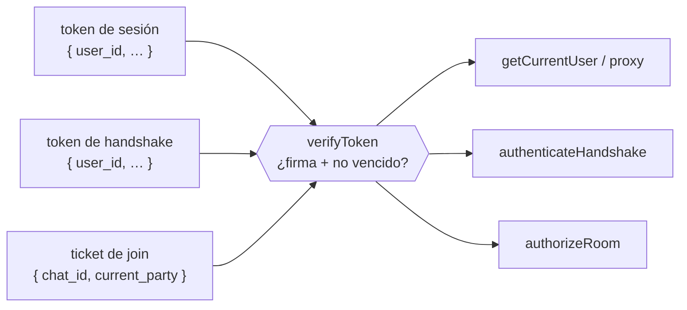

# TD-24 — Claim de scope por tipo de token

| | |
|---|---|
| **Branch** | `hardening/token-scope-claims` |
| **Bloque** | Seguridad |
| **Prioridad** | 🟢 Baja |
| **Esfuerzo** | ~2-3 h |
| **Depende de** | — (surge de **TD-08**) |
| **Origen** | Hardening identificado al implementar TD-08 (ticket firmado para el join) |
| **Repos** | `bookings_app` + `bookings-app-worker` |

## Problema

Hay tres tokens JWT firmados con **el mismo `JWT_SECRET`**, para propósitos distintos:

| Token | Firmado en | Claims | Verificado en |
|---|---|---|---|
| Sesión (cookie `token`) | `createAccessToken` | `user_id, email, name, is_host, roles, permissions` | `getCurrentUser` / `proxy` |
| Handshake del socket | `getUserToken` | idénticas al de sesión | `authenticateHandshake` (worker) |
| Ticket del join | `getChatHistory` → `signToken` | `chat_id, guest_id, host_id, current_party` | `authorizeRoom` (worker) |

Cada verificador usa el mismo `verifyToken`, que solo responde *"¿firma válida y no vencido?"* — **nunca** *"¿es el tipo de token correcto para este uso?"*. No hay ningún claim que diga para qué sirve cada token.

Consecuencia: cualquier token válido pasa por cualquier compuerta que su shape no rechace. En concreto:

1. **Un ticket entra por el handshake.** `authenticateHandshake` hace `verifyToken(token) as CurrentUser`; el ticket tiene firma válida, así que pasa. Hoy es inerte porque `socket.data.user` quedó sin uso tras TD-08 — pero es una trampa: el día que algo lea `socket.data.user.user_id`, un ticket sirve para conectarse con identidad falsa.
2. **El token de handshake vale como sesión.** Tiene las mismas claims que el de sesión, así que si se filtra (log, XSS en su ventana de 5 min) se puede setear como cookie `token` y `getCurrentUser` lo acepta → sesión completa. El TTL corto acota la ventana, no elimina la equivalencia.

## Por qué entra

- **Seguridad / least privilege.** Un token debería valer **solo** para su propósito. Hoy el TTL corto es la única barrera para la consecuencia (2), y no hay ninguna para la (1).
- **Ventana de costo bajo.** No es explotable sin un compromiso previo (XSS) y la superficie de auth todavía es chica: cuesta mucho menos hacerlo ahora que cuando aparezcan más tipos de token o algo empiece a confiar en `socket.data.user`.
- **Aprendizaje.** El claim de `scope`/`aud` es el patrón estándar de JWT para atar un token a su uso; es la mitad que faltó del hardening del handshake.

## Alcance

- Definir un scope por tipo de token: `session`, `socket`, `chat-join`.
- Cada firma agrega su scope:
  - `createAccessToken` → `session`
  - `getUserToken` → `socket`
  - `getChatHistory` (ticket) → `chat-join`
- Cada verificación exige el suyo y rechaza el resto:
  - `getCurrentUser` / el guard de `proxy` → `session`
  - `authenticateHandshake` → `socket`
  - `authorizeRoom` → `chat-join`

Con `session` ≠ `socket`, un token de socket robado deja de valer como sesión (cierra la consecuencia 2). Con `authenticateHandshake` exigiendo `socket`, un ticket deja de pasar el handshake (cierra la 1).

## Criterio de aceptación

- [ ] Cada token lleva su claim de scope.
- [ ] Un token de socket seteado como cookie `token` es rechazado por `getCurrentUser`.
- [ ] Un token de identidad no autoriza un room en `authorizeRoom`; un ticket no pasa `authenticateHandshake`.
- [ ] El chat sigue funcionando end-to-end con dos cuentas.

## Fuera de alcance

- Secretos distintos por audiencia (un `JWT_SECRET` por tipo de token es más fuerte aún, pero es otro eje).
- Revocación a mitad de una conexión ya abierta (logout mientras el socket vive) — es otro problema, no de scope.
