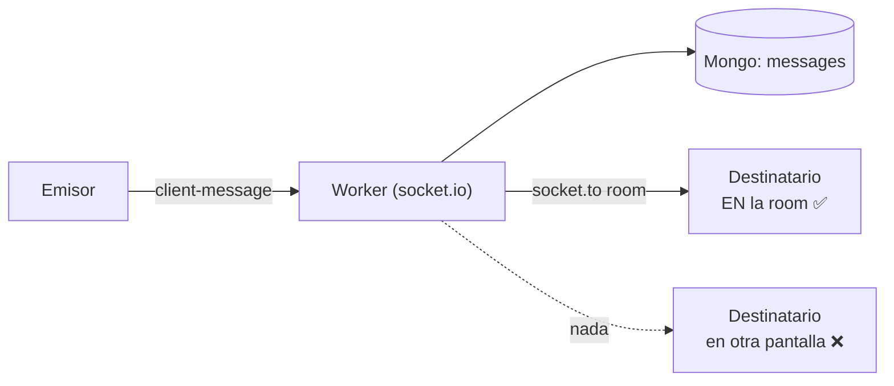
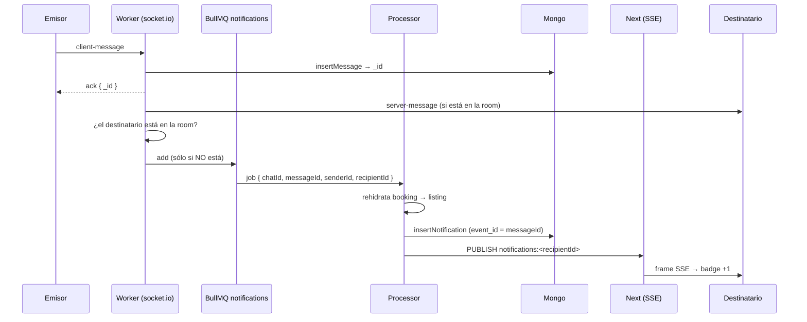

# TD-25 — Notificar mensajes nuevos (fan-out fuera de la room)

| | |
|---|---|
| **Branch** | `feat/message-notifications` |
| **Bloque** | Chat / Notificaciones |
| **Prioridad** | 🟠 Media |
| **Esfuerzo** | ~4-6 h |
| **Depende de** | [**TD-26**](./TD-26-worker-job-traceability.md) (hacer antes) · se apoya en **TD-08**: el ticket ya trae las dos party ids |
| **Origen** | Gap funcional del chat: un mensaje sólo existe para quien ya está en la room |
| **Repos** | `bookings-worker` (casi todo) + `bookings_app` (deep link) |

## Problema

Un mensaje hoy sale por un solo camino: `socket.to(chat_id).emit(...)`
(`src/chat/message-flow.ts`). Eso llega **sólo a los sockets que hicieron join a esa room**. Si el
destinatario está en otra pantalla de la app —o desconectado— no pasa nada: no hay documento de
notificación en Mongo, no hay `PUBLISH`, no hay badge. El mensaje aparece recién si entra al chat.

La infra de fan-out ya está entera y funciona (worker → Mongo → `notifications:<userId>` →
ruta SSE → `NotificationsProvider`). Lo que falta es un **productor nuevo**: hoy el único que
alimenta la cola `notifications` es el relay del outbox de Postgres, y los mensajes nunca tocan
Postgres — nacen y mueren en el borde del socket.

## Por qué entra

- **Gap funcional, no deuda.** Una mensajería que sólo avisa a quien ya está mirando la
  conversación no avisa nada. Es la mitad que faltó al cerrar TD-08/TD-09.
- **Costo bajo.** Las cuatro piezas del camino (cola, processor, insert idempotente, canal Redis,
  SSE, badge) ya existen y están probadas por las notificaciones de booking. Lo único que se
  construye es el productor y el copy.
- **Aprendizaje.** Es el primer productor de la cola que **no** viene del outbox: obliga a separar
  "evento transaccional de Postgres" de "evento efímero del borde", que hasta ahora estaban
  fundidos en un solo camino.

## Alcance

### Decisiones tomadas

| # | Decisión | Elegido | Por qué |
|---|---|---|---|
| 1 | Quién produce la notificación | **Encolar** en `notificationsQueue` desde el flujo de mensaje; la arma el processor | El worker ya tiene la Queue como productor (`src/redis/queues.ts`) y el processor ya hace insert+publish. Hereda reintentos y backoff. El hot path del mensaje suma un `add`, no dos I/O antes del ack |
| 2 | Idempotencia | El `_id` que Mongo minta en `insertMessage`, usado como `event_id` | El índice único de `notifications` es sobre `event_id` y acá no hay fila de outbox que lo provea. El `_id` del mensaje es único por naturaleza y sobrevive a los reintentos de BullMQ |
| 3 | Cuándo **no** notificar | Suprimir si el destinatario ya está en la room (`io.in(chat_id).fetchSockets()`, comparar contra `socket.data.user.user_id`) | Es lo que evita el grueso del flood: en una conversación activa el mensaje ya llegó en vivo, y una notificación encima es ruido |
| 4 | Granularidad | **Una notificación por mensaje** | Colapsar por conversación exige que el repo gane un `update` y que el cliente distinga "nueva" de "actualizada" para no sumar +1 al badge. Con la supresión de #3, el caso patológico se reduce a "el otro escribe 10 veces mientras vos estás en otra pantalla" |
| 5 | Datos que faltan en el borde del socket | El job lleva **sólo ids**; el processor rehidrata | El ticket (`ChatParties`) da `chat_id`, `host_id`, `guest_id` y `current_party` → el destinatario es la otra parte. Pero `listing_id` no está en el ticket y `buildNotification` lo exige. Rehidratar booking → listing en el processor es lo que ya hace `fan-out.ts` con el resto de los eventos |

### Cómo queda el flujo

El orden se mantiene igual que en el resto del pipeline: **persistir primero, fan-out después**
(ver [`REAL_TIME_TRANSPORT_AND_FAN_OUT.md`](../architecture/REAL_TIME_TRANSPORT_AND_FAN_OUT.md)).
El encolado va después del `insertMessage`, nunca antes.

### Piezas

**Worker** (asumiendo TD-26 hecho: un archivo por evento + `switch` tipado)

- `src/notifications/message.ts` — **archivo nuevo con el evento entero**: copy, builder y handler.
- `src/events.ts` — el `MessageNotificationPayload`, sumado a la unión `NotificationJob`. Con eso
  `tsc` marca el `switch` incompleto: esa es la lista de pendientes. El `type` de copy va **propio**
  del evento, no ampliando `InAppNotificationType` — esa tabla ahora es del archivo de booking.
- `src/processors/notifications.ts` — un `case` en el switch de la cola.
- `src/chat/message-flow.ts` — tras persistir: resolver destinatario desde las parties, chequear
  presencia en la room, encolar.

El icono no requiere nada: `notificationVisual` ya matchea `"message"` en el título.

**App**

- `components/notifications/notification-row.tsx` — la fila no es un link: no hay forma de saltar a
  la conversación desde la notificación. Para las de mensaje, `href` a
  `/messages/<booking_id>` (el `booking_id` ya viaja en el documento).

El badge no requiere cambios: `NotificationsProvider` suma +1 por cada frame SSE, sin mirar el
payload.

## Criterio de aceptación

- [ ] Con el destinatario en **otra pantalla** de la app: le entra el badge y la fila en
      `/notifications` sin recargar.
- [ ] Con el destinatario **dentro de la conversación**: recibe el mensaje en vivo y **ninguna**
      notificación.
- [ ] Con el destinatario **desconectado**: al volver, la notificación está en la lista (vino de
      Mongo, no del canal).
- [ ] Reintentar el job (o mandar el mismo `messageId` dos veces) no duplica el documento.
- [ ] La fila de una notificación de mensaje lleva a su conversación.
- [ ] `docs/architecture/REAL_TIME_TRANSPORT_AND_FAN_OUT.md` y
      [`BULLMQ_QUEUES.md`](../architecture/BULLMQ_QUEUES.md) reflejan que la cola `notifications`
      pasa a tener un segundo productor, que nace **dentro del worker** y no en el outbox.

## Fuera de alcance

- **Colapsar por conversación** (una sola notificación viva por hilo, actualizada en vez de
  duplicada). Es el paso 2 natural, pero cambia el repo de notificaciones de insert-only a
  insert+update y obliga al cliente a distinguir alta de actualización para el conteo. Se revisita
  si el flood aparece en la práctica.
- **Deep link para el resto de las notificaciones** (booking → `/bookings/<id>`). Mismo mecanismo,
  otro ticket: acá sólo se resuelve el caso de mensaje.
- **Email por mensaje nuevo.** Otra cola, otra decisión (frecuencia, digest, opt-out).
- **Contador de no leídos por conversación** en el rail de `/messages`. Necesitaría que el cliente
  lea el payload del frame SSE, que hoy ignora.
- **Presencia real** (online/away/typing). Acá se usa un único hecho puntual —¿hay un socket de este
  usuario en esta room?— resuelto en el momento de decidir, no un estado de presencia mantenido.
